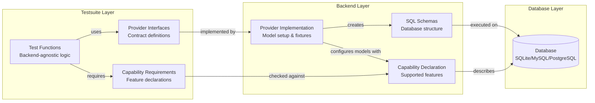

# Test Suite Documentation

This documentation provides comprehensive guides for using the test suite.

## Table of Contents
- [1. Introduction](#1-introduction)
- [2. Getting Started for Backend Developers](#2-getting-started-for-backend-developers)

## [1. Introduction](#1-introduction)

Welcome to the ActiveRecord Test Suite. This package provides a standardized testing contract for all database backends integrating with the `rhosocial-activerecord` library.

The primary goal is to ensure that every backend, whether official or third-party, behaves consistently and correctly according to the core library's expectations. The suite is built on three pillars:

- **Feature Tests**: Validate individual, atomic functionalities (e.g., CRUD operations, query methods, field types).
- **Real-world Scenarios**: Simulate complex business logic to test interactions between different components.
- **Benchmark Tests**: Measure and compare performance metrics across different backends.

**Important**: This test suite contains only the test logic and does not include environment preparation such as fixtures or database schemas. Instead, it provides **interfaces** that backends should implement to provide these resources. Each backend implementation is responsible for creating and managing its own test environment according to the provided interfaces.

### Architecture Overview

The test suite and backend relationship follows a clear separation of concerns:

```mermaid
graph TB
    subgraph "Backend Packages" 
        direction TB
        MYSQL[rhosocial-activerecord-mysql<br/>- Backend implementation<br/>- Schema definitions<br/>- Backend-specific tests]
        DEFAULT[rhosocial-activerecord<br/>- Default backend<br/>- Core functionality<br/>- Backend-specific tests]
    end

    subgraph "Testsuite Package" 
        direction TB
        TS[rhosocial-activerecord-testsuite<br/>- Standardized test contracts<br/>- Feature tests<br/>- Real-world scenarios<br/>- Performance benchmarks]
    end

    subgraph "Backend Developer Responsibilities" 
        direction TB
        PROVIDER[Implement test providers<br/>- Set up database schemas<br/>- Configure test models<br/>- Provide fixtures]
        SCHEMA[SQL Schema Creation<br/>- Create backend-specific<br/>  schema files<br/>- Match testsuite structure]
        REPORT[Generate compatibility reports<br/>- Run standardized tests<br/>- Track compatibility scores]
    end

    subgraph "Testsuite Author Responsibilities" 
        direction TB
        TESTDEF[Test Definition<br/>- Write backend-agnostic<br/>  test functions<br/>- Define test contracts<br/>- Provide test utilities]
        MARKER[Test Marking<br/>- Standard pytest markers<br/>- Categorization system<br/>- Feature identification]
        UTIL[Test Utilities<br/>- Schema generators<br/>- Helper functions<br/>- Provider interfaces]
    end

    %% Relationship arrows
    MYSQL -.->|uses| TS
    DEFAULT -.->|uses| TS
    PROVIDER -->|fulfills| TS
    SCHEMA -->|supports| TS
    REPORT -->|verifies| TS
    TESTDEF -->|provides| TS
    MARKER -->|organizes| TS
    UTIL -->|facilitates| TS

    style TS fill:#e1f5fe,stroke:#01579b,stroke-width:2px
    style MYSQL fill:#f3e5f5,stroke:#4a148c,stroke-width:2px
    style DEFAULT fill:#f3e5f5,stroke:#4a148c,stroke-width:2px
    style PROVIDER fill:#e8f5e8,stroke:#1b5e20,stroke-width:2px
    style SCHEMA fill:#e8f5e8,stroke:#1b5e20,stroke-width:2px
    style REPORT fill:#e8f5e8,stroke:#1b5e20,stroke-width:2px
    style TESTDEF fill:#fff3e0,stroke:#e65100,stroke-width:2px
    style MARKER fill:#fff3e0,stroke:#e65100,stroke-width:2px
    style UTIL fill:#fff3e0,stroke:#e65100,stroke-width:2px
```



### Testing Layer Architecture



### Responsibilities Division

#### Testsuite Authors MUST:
- Write backend-agnostic test logic
- Define provider interfaces
- Create test fixtures and utilities
- NEVER assume backend-specific features
- NEVER write SQL directly in tests
- Document required capabilities using correct category+capability format

#### Backend Developers MUST:
- Implement provider interfaces
- Create backend-specific schema files
- Handle database connection/cleanup
- Write backend-specific tests separately
- Generate compatibility reports
- Declare backend capabilities using add_* methods

### Division of Labor

| Component | Testsuite | Backend |
|-----------|-----------|---------|
| Test logic | ✅ Defines | Uses |
| SQL schemas | Provides templates | ✅ Implements |
| Database setup | Defines interface | ✅ Implements |
| Model configuration | Defines fixtures | ✅ Provides models |
| Cleanup/teardown | Defines hooks | ✅ Implements |
| Capability declaration | Defines requirements | ✅ Declares support |

## [2. Getting Started for Backend Developers](#2-getting-started-for-backend-developers)

To use this test suite to validate your custom database backend, follow these steps:

### Prerequisites

- A working database backend implementation that inherits from `rhosocial.activerecord.backend.StorageBackend`.
- Your backend package should be installable in the test environment.
- Your backend must implement the required interfaces for providing test fixtures and database schemas.

### Installation

Add `rhosocial-activerecord-testsuite` as a development dependency in your backend's `pyproject.toml`:

```toml
[project.optional-dependencies]
dev = [
    "rhosocial-activerecord-testsuite",
    "pytest-cov"
]
```