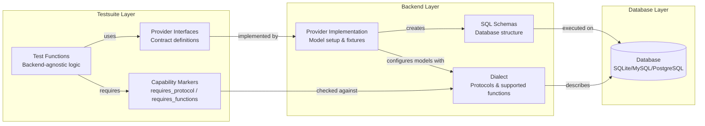

# Test Suite Documentation

This documentation provides comprehensive guides for using the test suite.

## Table of Contents
- [1. Introduction](#1-introduction)
- [2. Getting Started for Backend Developers](#2-getting-started-for-backend-developers)

## [1. Introduction](#1-introduction)

Welcome to the ActiveRecord Test Suite. This package provides a standardized testing contract for all database backends integrating with the `rhosocial-activerecord` library.

The primary goal is to ensure that every backend, whether official or third-party, behaves consistently and correctly according to the core library's expectations. The suite is built on three pillars:

- **Feature Tests**: Validate individual, atomic functionalities (e.g., CRUD operations, query methods, field types).
- **Real-world Scenarios**: Simulate complex business logic to test interactions between different components.
- **Benchmark Tests**: Measure and compare performance metrics across different backends.

**Important**: This test suite contains only the test logic and does not include environment preparation such as fixtures or database schemas. Instead, it provides **interfaces** that backends should implement to provide these resources. Each backend implementation is responsible for creating and managing its own test environment according to the provided interfaces.

### Architecture Overview

The test suite and backend relationship follows a clear separation of concerns:


```mermaid
graph TB
    subgraph "Backend Packages" 
        direction TB
        MYSQL[rhosocial-activerecord-mysql<br/>- Backend implementation<br/>- Schema definitions<br/>- Backend-specific tests]
        DEFAULT[rhosocial-activerecord<br/>- Default backend<br/>- Core functionality<br/>- Backend-specific tests]
    end

    subgraph "Testsuite Package" 
        direction TB
        TS[rhosocial-activerecord-testsuite<br/>- Standardized test contracts<br/>- Feature tests<br/>- Real-world scenarios<br/>- Performance benchmarks]
    end

    subgraph "Backend Developer Responsibilities" 
        direction TB
        PROVIDER[Implement test providers<br/>- Set up database schemas<br/>- Configure test models<br/>- Provide fixtures]
        SCHEMA[SQL Schema Creation<br/>- Create backend-specific<br/>  schema files<br/>- Match testsuite structure]
        REPORT[Generate compatibility reports<br/>- Run standardized tests<br/>- Track compatibility scores]
    end

    subgraph "Testsuite Author Responsibilities" 
        direction TB
        TESTDEF[Test Definition<br/>- Write backend-agnostic<br/>  test functions<br/>- Define test contracts<br/>- Provide test utilities]
        MARKER[Test Marking<br/>- Standard pytest markers<br/>- Categorization system<br/>- Feature identification]
        UTIL[Test Utilities<br/>- Schema generators<br/>- Helper functions<br/>- Provider interfaces]
    end

    %% Relationship arrows
    MYSQL -.->|uses| TS
    DEFAULT -.->|uses| TS
    PROVIDER -->|fulfills| TS
    SCHEMA -->|supports| TS
    REPORT -->|verifies| TS
    TESTDEF -->|provides| TS
    MARKER -->|organizes| TS
    UTIL -->|facilitates| TS

    style TS fill:#e1f5fe,stroke:#01579b,stroke-width:2px
    style MYSQL fill:#f3e5f5,stroke:#4a148c,stroke-width:2px
    style DEFAULT fill:#f3e5f5,stroke:#4a148c,stroke-width:2px
    style PROVIDER fill:#e8f5e8,stroke:#1b5e20,stroke-width:2px
    style SCHEMA fill:#e8f5e8,stroke:#1b5e20,stroke-width:2px
    style REPORT fill:#e8f5e8,stroke:#1b5e20,stroke-width:2px
    style TESTDEF fill:#fff3e0,stroke:#e65100,stroke-width:2px
    style MARKER fill:#fff3e0,stroke:#e65100,stroke-width:2px
    style UTIL fill:#fff3e0,stroke:#e65100,stroke-width:2px
```

### Testing Layer Architecture


```mermaid
graph LR
    subgraph "Testsuite Layer"
        TEST[Test Functions<br/>Backend-agnostic logic]
        IFACE[Provider Interfaces<br/>Contract definitions]
        CAPS[Capability Markers<br/>requires_protocol / requires_functions]
    end
    
    subgraph "Backend Layer"
        PROV[Provider Implementation<br/>Model setup & fixtures]
        SCHEMA[SQL Schemas<br/>Database structure]
        DIALECT[Dialect<br/>Protocols & supported functions]
    end
    
    subgraph "Database Layer"
        DB[(Database<br/>SQLite/MySQL/PostgreSQL)]
    end
    
    TEST -->|uses| IFACE
    TEST -->|requires| CAPS
    IFACE -->|implemented by| PROV
    CAPS -->|checked against| DIALECT
    PROV -->|creates| SCHEMA
    PROV -->|configures models with| DIALECT
    SCHEMA -->|executed on| DB
    DIALECT -->|describes| DB
```

### Responsibilities Division

#### Testsuite Authors MUST:
- Write backend-agnostic test logic
- Define provider interfaces
- Create test fixtures and utilities
- NEVER assume backend-specific features
- NEVER write SQL directly in tests
- Document required capabilities using `requires_protocol` / `requires_functions`

#### Backend Developers MUST:
- Implement provider interfaces (paired `setup_*_fixtures` / `async_setup_*_fixtures`)
- Create backend-specific schema files
- Handle database connection/cleanup
- Import the testsuite into your own `tests/` tree via thin bridge files
- Wire `TESTSUITE_PROVIDER_REGISTRY` to your provider registry

### Provider Responsibilities

The Provider design pattern is central to the test suite. Each backend must implement a provider that handles:

1. **Environment Preparation** (Setup):
   - Creating database schemas (tables, indexes, constraints)
   - Establishing database connections
   - Configuring test models with backend-specific implementations

2. **Environment Cleanup** (Teardown):
   - Dropping test tables
   - Closing cursors properly
   - Disconnecting from the database

**Critical: Cleanup Order**

The provider MUST handle cleanup in the correct order to avoid issues:

```
Correct Order:
1. Execute DROP TABLE statements (cleanup data)
2. Close all cursors
3. Disconnect from database

Incorrect Order:
1. Disconnect first  ❌
2. Then try to cleanup  ❌ (connection already closed!)
```

**Why This Matters:**

Different backends have different requirements:

- **MySQL Async**: Closing connection before cursors can cause `RuntimeError: Set changed size during iteration` (due to WeakSet modification during iteration)
- **Table Conflicts**: Not dropping tables can cause "table already exists" errors
- **Data Contamination**: Not cleaning up can cause context-dependent tests to fail
- **Connection Issues**: Improper cleanup can leave dangling connections, causing resource exhaustion

**Implementation Example:**

```python
async def async_teardown_order_fixtures(self, scenario_name: str):
    """Proper cleanup order: data first, then cursors, then disconnect."""
    # Step 1: Drop tables (while connection is alive)
    for table in tables_to_drop:
        await self._backend.execute(f"DROP TABLE IF EXISTS {table}")
    
    # Step 2: Close cursors explicitly (before disconnecting)
    connection = self._backend._connection
    if connection is not None:
        for cursor in list(connection._cursors):
            await cursor.close()
    
    # Step 3: Disconnect (last step)
    await self._backend.disconnect()
```

### Division of Labor

| Component | Testsuite | Backend |
|-----------|-----------|---------|
| Test logic | ✅ Defines | Uses |
| SQL schemas | Provides templates | ✅ Implements |
| Database setup | Defines interface | ✅ Implements |
| Model configuration | Defines fixtures | ✅ Provides models |
| Cleanup/teardown | Defines hooks | ✅ Implements |
| Capability handling | Defines requirements via `requires_protocol` / `requires_functions` | ✅ Implements dialect protocols & functions |

## [2. Getting Started for Backend Developers](#2-getting-started-for-backend-developers)

To use this test suite to validate your custom database backend, follow these steps:

### Prerequisites

- A working database backend implementation that inherits from `rhosocial.activerecord.backend.StorageBackend`.
- Your backend package should be installable in the test environment.
- Your backend must implement the required interfaces for providing test fixtures and database schemas.

### Installation

Add `rhosocial-activerecord-testsuite` as a development dependency in your backend's `pyproject.toml`:

```toml
[project.optional-dependencies]
dev = [
    "rhosocial-activerecord-testsuite",
    "pytest-cov"
]
```