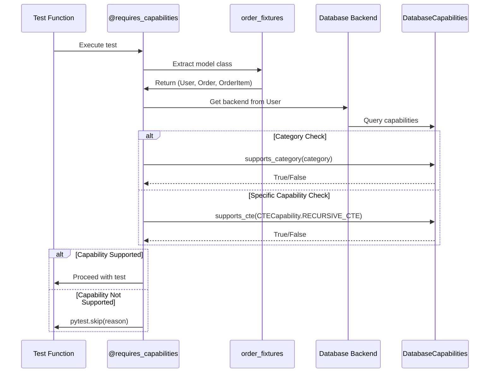

# Configuration Guide

This document details the various configuration options available for the test suite.

## Table of Contents
- [1. Interface-Based Configuration System](#1-interface-based-configuration-system)
- [2. Provider Pattern Implementation](#2-provider-pattern-implementation)
- [3. Backend Capability Declaration](#3-backend-capability-declaration)
- [4. Capability-Based Test Selection](#4-capability-based-test-selection)

## [1. Interface-Based Configuration System](#1-interface-based-configuration-system)

The test suite operates based on a flexible interface system that allows backends to implement and provide their own configuration, schema, and fixture management. The test suite defines what's needed, but backends are responsible for providing the implementation.

### Provider Pattern Implementation

The provider pattern enables test reuse across backends:

1. **Testsuite defines** test logic and provider interface
2. **Backend implements** provider to configure models/schemas
3. **Test execution** uses provider to run same tests on different backends
4. **Capability checking** determines which tests can run

### Core Provider Interface

```python
from abc import ABC, abstractmethod
from typing import Type, List, Tuple
from rhosocial.activerecord import ActiveRecord

class IQueryProvider(ABC):
    """Provider interface for query feature tests."""
    
    @abstractmethod
    def get_test_scenarios(self) -> List[str]:
        """Return available test scenarios (e.g., 'local', 'docker')."""
        pass
    
    @abstractmethod
    def setup_order_fixtures(self, scenario_name: str) -> Tuple[Type[ActiveRecord], Type[ActiveRecord], Type[ActiveRecord]]:
        """
        Setup order-related models (User, Order, OrderItem).

        Returns:
            Tuple of (User, Order, OrderItem) model classes
        """
        pass
    
    @abstractmethod
    def setup_tree_fixtures(self, scenario_name: str) -> Tuple[Type[ActiveRecord]]:
        """
        Setup tree structure model (Node).

        Returns:
            Single-element tuple containing (Node,)
        """
        pass
    
    @abstractmethod
    def cleanup_after_test(self, scenario_name: str):
        """Cleanup after test execution."""
        pass
```

### Backend Drivers and Namespaces

Before configuring, it's important to understand how backends are loaded:

- **Official Backends**: Backends released by `rhosocial` are installed under the `rhosocial.activerecord.backend.impl` namespace (e.g., `...impl.mysql`). The test suite's default configuration loader knows how to find these.
- **Third-Party Backends**: If you are developing a third-party backend, it should reside in its own namespace (e.g., `acme_corp.activerecord.backend.impl.acme_db`). To make the test suite aware of your driver, you would need to register it, typically using Python's `entry_points` mechanism in your package's `pyproject.toml`.

### Required Backend Interfaces

Each backend must implement the following interfaces to properly work with the test suite:

- **Schema Provider Interface**: To create and manage database schemas per test requirements.
- **Fixture Provider Interface**: To supply test fixtures according to test specifications.
- **Configuration Provider Interface**: To handle backend-specific configuration options.

### Built-in SQLite Support

The test suite includes built-in support for testing the `sqlite` backend that ships with `rhosocial-activerecord`. The configurations are determined by the Python version you are using to run the tests.

- **Automatic Detection**: By default, the test suite detects the current Python version (e.g., 3.11) and runs tests against its corresponding SQLite version (e.g., `sqlite_py311_mem` and `sqlite_py311_file`).
- **CI/CD Override**: You can force tests to run against a specific Python version's configuration by setting the `PYTEST_TARGET_VERSION` environment variable. For example:
    ```bash
    PYTEST_TARGET_VERSION=3.10 pytest
    ```

### SQLite Test Scenarios

The `rhosocial-activerecord` backend for SQLite supports several predefined test scenarios, which can be activated via environment variables. These scenarios allow for testing different operational modes and performance characteristics of SQLite.

- **`memory`**: The default and fastest scenario, using an in-memory SQLite database. This is always active.
- **`tempfile`**: Uses a temporary file on disk for the database. Useful for testing features that require database persistence. Activated by setting `TEST_SQLITE_FILE=true`.
- **`debug`**: An in-memory database with SQL echoing enabled (via logging configuration) for debugging purposes. Activated by setting `TEST_SQLITE_DEBUG=true`.
- **`performance`**: An in-memory database configured with optimized PRAGMA settings for performance testing. Activated by setting `TEST_SQLITE_PERFORMANCE=true`.
- **`concurrent`**: Uses a file-based database with WAL (Write-Ahead Logging) mode enabled for concurrency testing. Activated by setting `TEST_SQLITE_CONCURRENT=true`.

You can enable multiple scenarios simultaneously by setting their respective environment variables. For example:

```bash
export TEST_SQLITE_FILE=true
export TEST_SQLITE_DEBUG=true
export TEST_SQLITE_PERFORMANCE=true
export TEST_SQLITE_CONCURRENT=true
pytest
```

Alternatively, you can specify which scenarios to run using the `--test-scenarios` pytest option:

```bash
pytest --test-scenarios="memory,debug"
```

### Custom Backend Configuration

To test your own backend (or other optional backends like MySQL, PostgreSQL), you need to configure the connection details. This can be done using environment variables.

#### Using Environment Variables (Recommended)

You can define one or more test targets by setting a series of environment variables in the shell where `pytest` is executed. Use a numeric suffix (`_1`, `_2`, etc.) to distinguish between different configurations.

For example, to define a test target named `mysql_ci`:
```bash
export AR_TEST_BACKEND_NAME_1=mysql_ci
export AR_TEST_BACKEND_DRIVER_1=mysql
export AR_TEST_BACKEND_HOST_1=127.0.0.1
export AR_TEST_BACKEND_PORT_1=3306
export AR_TEST_BACKEND_USER_1=root
export AR_TEST_BACKEND_PASSWORD_1=password
export AR_TEST_BACKEND_DATABASE_1=test_db
```

## 2. Capability-Based Test Selection

### Overview

The capability negotiation mechanism uses a two-level hierarchy:

1. **Capability Categories** (CapabilityCategory): Top-level groupings like CTE, WINDOW_FUNCTIONS
2. **Specific Capabilities**: Individual features within each category

### Capability Architecture

```python
# Capability hierarchy structure
CapabilityCategory.CTE                    # Category
    ├── CTECapability.BASIC_CTE          # Specific capability
    ├── CTECapability.RECURSIVE_CTE      # Specific capability
    └── CTECapability.MATERIALIZED_CTE   # Specific capability

CapabilityCategory.WINDOW_FUNCTIONS       # Category
    ├── WindowFunctionCapability.ROW_NUMBER
    ├── WindowFunctionCapability.RANK
    └── WindowFunctionCapability.LAG

# Pre-defined combinations
ALL_CTE_FEATURES = (
    CTECapability.BASIC_CTE |
    CTECapability.RECURSIVE_CTE |
    CTECapability.COMPOUND_RECURSIVE_CTE |
    CTECapability.CTE_IN_DML |
    CTECapability.MATERIALIZED_CTE
)
```

### Backend Capability Declaration

```python
# Backend declares its capabilities
# src/rhosocial/activerecord/backend/impl/sqlite/backend.py
from rhosocial.activerecord.backend.capabilities import (
    DatabaseCapabilities,
    CapabilityCategory,
    CTECapability,
    WindowFunctionCapability,
    ALL_CTE_FEATURES,
    ALL_WINDOW_FUNCTIONS
)

class SQLiteBackend(StorageBackend):
    def _initialize_capabilities(self):
        """Initialize and return the backend's capability descriptor."""
        capabilities = DatabaseCapabilities()
        version = self.get_server_version()

        # CTEs supported from 3.8.3+
        if version >= (3, 8, 3):
            # Add specific capabilities
            capabilities.add_cte([
                CTECapability.BASIC_CTE,
                CTECapability.RECURSIVE_CTE
            ])
            # This automatically adds CapabilityCategory.CTE

        # Window functions from 3.25.0+
        if version >= (3, 25, 0):
            # Use pre-defined combination
            capabilities.add_window_function(ALL_WINDOW_FUNCTIONS)

        return capabilities
```

### Declaring Test Requirements

Tests must specify BOTH category AND specific capability:

```python
# Correct format: (category, specific_capability)
from rhosocial.activerecord.backend.capabilities import (
    CapabilityCategory,
    CTECapability
)
from rhosocial.activerecord.testsuite.utils import requires_capabilities

# Single capability requirement
@requires_capabilities((CapabilityCategory.CTE, CTECapability.BASIC_CTE))
def test_basic_cte(order_fixtures):
    """Test requires basic CTE support."""
    pass

# Multiple capabilities from same category
@requires_capabilities((CapabilityCategory.CTE, [CTECapability.BASIC_CTE, CTECapability.RECURSIVE_CTE]))
def test_recursive_cte(tree_fixtures):
    """Test requires both basic and recursive CTE."""
    pass

# Multiple capabilities from different categories
@requires_capabilities(
    (CapabilityCategory.CTE, CTECapability.RECURSIVE_CTE),
    (CapabilityCategory.WINDOW_FUNCTIONS, WindowFunctionCapability.ROW_NUMBER)
)
def test_complex_query(order_fixtures):
    """Test requires recursive CTE and window functions."""
    pass

# Category-only check (any capability in category)
@requires_capabilities((CapabilityCategory.JSON_OPERATIONS, None))
def test_json_support(json_user_fixtures):
    """Test requires any JSON operation support."""
    pass
```

### Capability Checking Process



### Runtime vs Collection-Time Checking

**Collection-time checking** (in conftest.py):
- Faster - checks capabilities before test execution
- Requires access to backend during collection phase
- May need workaround if backend initialization is expensive
- Can cause issues if trying to access fixtures during setup

**Runtime checking** (in test or decorator):
- Slower - capabilities checked during test execution
- Always accurate - uses actual configured backend
- Recommended for dynamic capability scenarios
- Use `pytest_runtest_call` hook to access `item.funcargs` which contains already resolved fixtures

**Common Issue & Solution:**
If capability checks are performed in `pytest_runtest_setup` and attempt to access fixtures, it can cause issues like:
`AssertionError: (<Function test_func[memory]>, {})` - This happens when trying to access fixtures during test setup.
Move capability checks to `pytest_runtest_call` and access fixtures via `item.funcargs` instead of `request.getfixturevalue()`.

### Fixtures vs Raw Objects Access Patterns

**Composite Fixtures Return Pattern:**
When fixtures return tuples of models (like `order_fixtures` returns `(User, Order, OrderItem)`) but test expects a tuple:
- Test code may use: `Node = tree_fixtures[0]`
- But fixture returns raw object: `yield Node` instead of `yield (Node,)`
- This causes error: `TypeError: cannot be parametrized because it does not inherit from typing.Generic`
- Solution: Ensure fixture returns tuple if test code expects tuple indexing

**Correct Fixture Implementation:**
```python
# If test uses tree_fixtures[0], return a tuple
@pytest.fixture
def tree_fixtures(request):
    # Get Node model for the test via fixture group
    result = provider.setup_tree_fixtures(scenario)
    
    # Ensure we return a tuple for consistency with test expectation
    if isinstance(result, tuple):
        yield result
    else:
        # If only a single model is returned, wrap it in a tuple
        yield (result,)
```