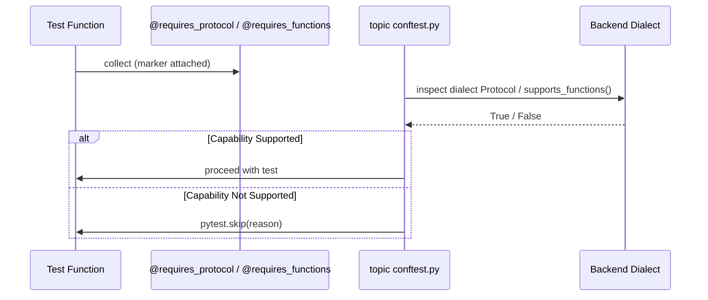

# Configuration Guide

This document details the various configuration options available for the test suite.

## Table of Contents
- [1. Interface-Based Configuration System](#1-interface-based-configuration-system)
- [2. Capability-Based Test Selection](#2-capability-based-test-selection)

## [1. Interface-Based Configuration System](#1-interface-based-configuration-system)

The test suite operates based on a flexible interface system that allows backends to implement and provide their own configuration, schema, and fixture management. The test suite defines what's needed, but backends are responsible for providing the implementation.

### Provider Pattern Implementation

The provider pattern enables test reuse across backends:

1. **Testsuite defines** test logic and provider interface
2. **Backend implements** provider to configure models/schemas
3. **Test execution** uses provider to run same tests on different backends
4. **Capability checking** determines which tests can run

### Core Provider Interface

```python
from abc import ABC, abstractmethod
from typing import Type, List, Tuple
from rhosocial.activerecord.model import ActiveRecord

class IQueryProvider(ABC):
    """Provider interface for query feature tests."""

    @abstractmethod
    def get_test_scenarios(self) -> List[str]:
        """Return available test scenarios (e.g., 'sqlite_memory', 'mysql_80')."""
        pass

    @abstractmethod
    def setup_order_fixtures(self, scenario_name: str) -> Tuple[Type[ActiveRecord], ...]:
        """
        Setup order-related models (User, Order, OrderItem).

        Returns:
            Tuple of (User, Order, OrderItem) model classes
        """
        pass

    @abstractmethod
    def teardown_order_fixtures(self, scenario_name: str) -> None:
        """Tear down order-related fixtures (disconnect, drop tables)."""
        pass

    @abstractmethod
    async def async_setup_order_fixtures(self, scenario_name: str) -> Tuple[Type[ActiveRecord], ...]:
        """
        Async setup of order-related models.

        Returns:
            Tuple of (AsyncUser, AsyncOrder, AsyncOrderItem) model classes
        """
        pass

    @abstractmethod
    async def async_teardown_order_fixtures(self, scenario_name: str) -> None:
        """Async teardown of order-related fixtures."""
        pass
```

Setup and teardown hooks are declared as **paired** methods, separately for
the sync and async APIs: `setup_*_fixtures` / `teardown_*_fixtures` and
`async_setup_*_fixtures` / `async_teardown_*_fixtures`. A backend that only
supports one side implements the corresponding pair and leaves the other pair
`@abstractmethod` (its conftest then imports only the supported files).

### Backend Drivers and Namespaces

Backends are discovered through the **provider registry**, not hard-coded by
the test suite:

- A backend registers its provider classes in `tests/providers/registry.py`.
- The test suite locates that registry through the
  `TESTSUITE_PROVIDER_REGISTRY` environment variable (the testsuite
  `conftest.py` defaults it to `providers.registry:provider_registry`; a
  backend may override it in its own `tests/conftest.py`).

### Required Backend Interfaces

Each backend must implement, per topic, the provider interface defined in that
topic's `interfaces.py` (schema creation, fixture generation, and
configuration are all part of the same provider contract). The contract is
paired: `setup_*_fixtures` / `teardown_*_fixtures` for sync and
`async_setup_*_fixtures` / `async_teardown_*_fixtures` for async.

### Built-in SQLite Support

The test suite includes built-in support for testing the `sqlite` backend
that ships with `rhosocial-activerecord`. SQLite is the reference backend:
it provides the provider implementations, scenario set, and model fixtures
that other backends mirror.

### Provider Registry and Scenarios

The testsuite decouples itself from any specific backend through a
**provider registry**. A backend exposes its provider implementations via a
registry module, and the testsuite locates it through the
`TESTSUITE_PROVIDER_REGISTRY` environment variable (the testsuite `conftest.py`
defaults it to `providers.registry:provider_registry`).

```bash
export TESTSUITE_PROVIDER_REGISTRY='tests.providers.registry:provider_registry'
```

Each provider advertises one or more **scenarios** (e.g. `sqlite_memory`,
`mysql_80`, `firebird_5`) via `get_test_scenarios()`. Tests are parametrized
across the registered scenarios. The `--scenarios` pytest option selects a
subset:

```bash
pytest --scenarios=sqlite_memory,mysql_80
```

### Custom Backend Configuration

To test your own backend, you write a provider that implements the topic
interfaces and register it in your backend's `tests/providers/registry.py`.
Connection details (host, port, credentials, database) live inside your
provider, not in the testsuite. The `--scenarios` option then selects which of
your scenarios to run.

Related conftest options:

- `--scenarios=<list>` — comma-separated scenario names to run.
- `--scenarios-parallel` / `--no-scenarios-parallel` — distribute scenario
  variants of a test across `pytest-xdist` workers (`default: True`).
- `--db-pool-size=<n>` — number of pooled `test_db_*` databases prepared per
  scenario (defaults to the number of workers; `0` disables pooling).
- `--serial-group=<name>` — `xdist_group` name used to pin serial tests.

## [2. Capability-Based Test Selection](#2-capability-based-test-selection)

### Overview

Backend-specific capabilities that are not universal across every database
are expressed with exactly **two** generic pytest decorators, both defined in
`rhosocial.activerecord.testsuite.utils`:

| Decorator | Marker | Captures |
|-----------|--------|----------|
| `requires_protocol(ProtocolClass, method_name=None)` | `requires_protocol` | A capability expressed by a Protocol class on the dialect (optionally a specific `supports_*` method). |
| `requires_functions(*fn_names)` | `requires_functions` | A capability expressed by SQL function name(s) the dialect's `supports_functions(...)` accepts. |

Both expand to a single pytest marker; the runtime skip logic lives in
topic-level `conftest.py` files, which read the markers via
`request.node.get_closest_marker(...)`. When the required capability is not
supported, the test is skipped — not failed — on that backend.

Do **not** introduce per-feature alias markers (e.g. `requires_partition`,
`requires_cte`, `requires_json`). The two generic decorators are the only
capability markers in the codebase.

### Declaring a Protocol-class requirement

```python
from rhosocial.activerecord.backend.dialect.protocols import WindowFunctionSupport
from rhosocial.activerecord.testsuite.utils import requires_protocol

# Protocol-level requirement (any support)
@requires_protocol(WindowFunctionSupport)
def test_window_functions(order_fixtures):
    """Test requires window function support."""
    pass

# Specific method requirement
@requires_protocol(WindowFunctionSupport, "supports_window_functions")
def test_window_functions(order_fixtures):
    """Test requires the supports_window_functions capability."""
    pass
```

### Declaring a SQL-function requirement

```python
from rhosocial.activerecord.testsuite.utils import requires_functions

# Single function requirement
@requires_functions('json_array_insert')
def test_json_insert(json_fixtures):
    """Test requires the json_array_insert SQL function."""
    pass

# Multiple function requirements (all must be supported)
@requires_functions('json_array_insert', 'jsonb_array_insert')
def test_json_operations(json_fixtures):
    """Test requires multiple JSON SQL functions."""
    pass
```

### Capability Checking Process


```mermaid
sequenceDiagram
    participant Test as Test Function
    participant Marker as @requires_protocol / @requires_functions
    participant Conftest as topic conftest.py
    participant Dialect as Backend Dialect
    
    Test->>Marker: collect (marker attached)
    Conftest->>Dialect: inspect dialect Protocol / supports_functions()
    Dialect-->>Conftest: True / False
    
    alt Capability Supported
        Conftest->>Test: proceed with test
    else Capability Not Supported
        Conftest->>Test: pytest.skip(reason)
    end
```

### Runtime vs Collection-Time Checking

Capability checks happen at **runtime**, after the backend is configured by the
provider, because backend capabilities are only available once the
provider-configured models are bound to a live backend for a given scenario.

- Topic-level `conftest.py` reads the marker during test execution
  (`request.node.get_closest_marker(...)`) and skips the test inline.
- Prefer the marker as the **single source of truth** for "this test requires
  capability X". Do **not** also re-check `supports_X()` in the test body;
  use inline `pytest.skip` only for scenario-local conditions.

### Fixtures vs Raw Objects Access Patterns

**Composite Fixtures Return Pattern:**
When fixtures return tuples of models (like `order_fixtures` returns
`(User, Order, OrderItem)`), the provider's `setup_*_fixtures` method must
return a tuple even for a single model, so the consuming test can index it
consistently.

Provider methods should therefore always return a tuple:

```python
# Correct — always a tuple, even for a single model
def setup_tree_fixtures(self, scenario):
    Node = self._configure_node(scenario)
    return (Node,)
```