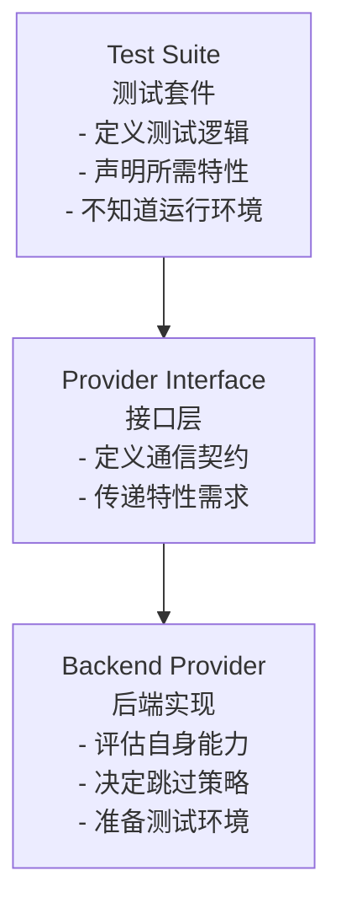
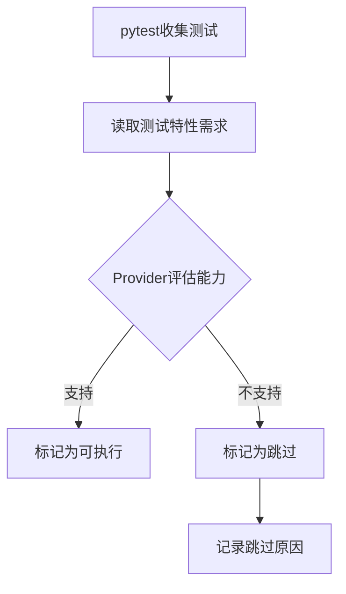
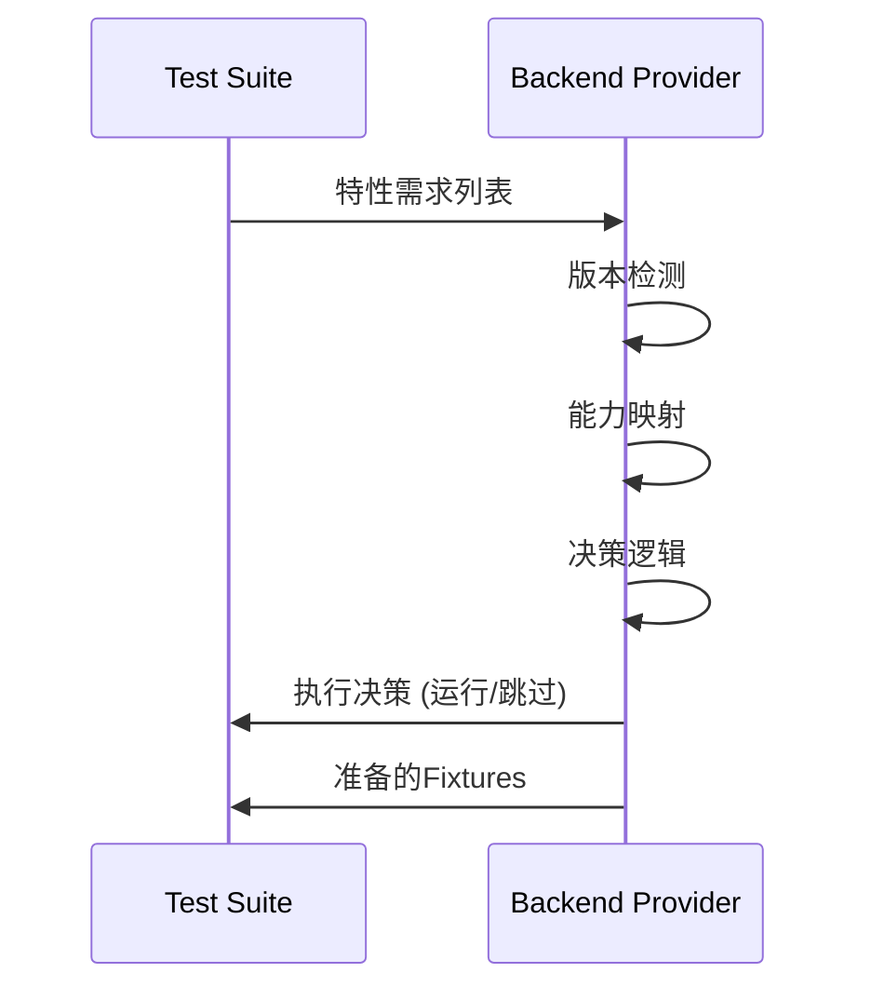

# 测试架构职责分配设计

## 架构概述

测试架构采用**关注点分离**原则，将测试逻辑与后端实现完全解耦。测试套件仅声明需求（特性列表），具体后端负责评估能力并决定执行策略。



## 一、测试套件职责

### 1.1 核心职责
- **定义测试逻辑**：纯粹的业务测试逻辑
- **声明特性需求**：每个测试需要哪些数据库特性
- **定义模型接口**：ActiveRecord模型的结构定义
- **提供测试工具**：通用的测试辅助函数

### 1.2 不负责的事项
- ❌ 不检查后端类型或版本
- ❌ 不包含SQL schema定义
- ❌ 不处理数据库连接
- ❌ 不决定是否跳过测试

### 1.3 特性声明方式

测试套件采用分层能力系统来声明特性需求，基于具体的数据库能力而非简单的功能标志。该能力协商系统的具体实现和定义位于 `python-activerecord` 项目中，通过 `src/rhosocial/activerecord/backend/capabilities.py` 文件提供完整的实现。

需要注意的是，当测试要求具备某个具体能力时，可以通过检查所属的顶级类别来区分能力类型，以避免歧义：

```python
# 测试套件使用分层能力系统声明需求
from enum import Flag, auto
from typing import Union, List

class CapabilityCategory(Flag):
    """顶级能力类别"""
    NONE = 0
    SET_OPERATIONS = auto()
    WINDOW_FUNCTIONS = auto()
    ADVANCED_GROUPING = auto()
    CTE = auto()
    JSON_OPERATIONS = auto()
    RETURNING_CLAUSE = auto()
    TRANSACTION_FEATURES = auto()
    BULK_OPERATIONS = auto()
    CONSTRAINTS = auto()
    PARTITIONING = auto()
    FULL_TEXT_SEARCH = auto()
    SPATIAL_OPERATIONS = auto()
    SECURITY_FEATURES = auto()

class SetOperationCapability(Flag):
    """集合操作能力"""
    NONE = 0
    UNION = auto()
    UNION_ALL = auto()
    INTERSECT = auto()
    INTERSECT_ALL = auto()
    EXCEPT = auto()
    EXCEPT_ALL = auto()

class WindowFunctionCapability(Flag):
    """窗口函数能力"""
    NONE = 0
    ROW_NUMBER = auto()
    RANK = auto()
    DENSE_RANK = auto()
    LAG = auto()
    LEAD = auto()
    FIRST_VALUE = auto()
    LAST_VALUE = auto()
    NTH_VALUE = auto()
    CUME_DIST = auto()
    PERCENT_RANK = auto()
    NTILE = auto()

class AdvancedGroupingCapability(Flag):
    """高级分组能力"""
    NONE = 0
    CUBE = auto()
    ROLLUP = auto()
    GROUPING_SETS = auto()

class CTECapability(Flag):
    """CTE能力"""
    NONE = 0
    BASIC_CTE = auto()
    RECURSIVE_CTE = auto()
    COMPOUND_RECURSIVE_CTE = auto()
    CTE_IN_DML = auto()
    MATERIALIZED_CTE = auto()

class JSONCapability(Flag):
    """JSON操作能力"""
    NONE = 0
    JSON_EXTRACT = auto()
    JSON_CONTAINS = auto()
    JSON_EXISTS = auto()
    JSON_SET = auto()
    JSON_INSERT = auto()
    JSON_REPLACE = auto()
    JSON_REMOVE = auto()
    JSON_KEYS = auto()
    JSON_ARRAY = auto()
    JSON_OBJECT = auto()

class ReturningCapability(Flag):
    """RETURNING子句能力"""
    NONE = 0
    BASIC_RETURNING = auto()
    RETURNING_EXPRESSIONS = auto()
    RETURNING_ALIASES = auto()

class TransactionCapability(Flag):
    """事务特性能力"""
    NONE = 0
    SAVEPOINT = auto()
    ISOLATION_LEVELS = auto()
    READ_ONLY_TRANSACTIONS = auto()

class BulkOperationCapability(Flag):
    """批量操作能力"""
    NONE = 0
    MULTI_ROW_INSERT = auto()
    BATCH_OPERATIONS = auto()

# 主要的能力描述符类
class DatabaseCapabilities:
    """数据库能力描述符"""
    def __init__(self):
        """初始化一个空的能力描述符"""
        self.categories: CapabilityCategory = CapabilityCategory.NONE
        self.set_operations: SetOperationCapability = SetOperationCapability.NONE
        self.window_functions: WindowFunctionCapability = WindowFunctionCapability.NONE
        self.advanced_grouping: AdvancedGroupingCapability = AdvancedGroupingCapability.NONE
        self.cte: CTECapability = CTECapability.NONE
        self.json_operations: JSONCapability = JSONCapability.NONE
        self.returning: ReturningCapability = ReturningCapability.NONE
        self.transactions: TransactionCapability = TransactionCapability.NONE
        self.bulk_operations: BulkOperationCapability = BulkOperationCapability.NONE
        
    def supports_category(self, category: CapabilityCategory) -> bool:
        """检查是否支持能力类别"""
        return bool(self.categories & category)
    
    def supports_set_operation(self, operation: SetOperationCapability) -> bool:
        """检查是否支持集合操作"""
        return bool(self.set_operations & operation)
    
    def supports_window_function(self, function: WindowFunctionCapability) -> bool:
        """检查是否支持窗口函数"""
        return bool(self.window_functions & function)
    
    def supports_advanced_grouping(self, grouping: AdvancedGroupingCapability) -> bool:
        """检查是否支持高级分组特性"""
        return bool(self.advanced_grouping & grouping)
    
    def supports_cte(self, cte_type: CTECapability) -> bool:
        """检查是否支持CTE特性"""
        return bool(self.cte & cte_type)
    
    def supports_json(self, json_op: JSONCapability) -> bool:
        """检查是否支持JSON操作"""
        return bool(self.json_operations & json_op)
    
    def supports_returning(self, returning_type: ReturningCapability) -> bool:
        """检查是否支持RETURNING特性"""
        return bool(self.returning & returning_type)
    
    def supports_transaction(self, transaction_feature: TransactionCapability) -> bool:
        """检查是否支持事务特性"""
        return bool(self.transactions & transaction_feature)
    
    def supports_bulk_operation(self, bulk_op: BulkOperationCapability) -> bool:
        """检查是否支持批量操作"""
        return bool(self.bulk_operations & bulk_op)
    
    def add_category(self, category: CapabilityCategory) -> 'DatabaseCapabilities':
        """添加能力类别"""
        self.categories |= category
        return self
    
    def add_set_operation(self, operation: SetOperationCapability) -> 'DatabaseCapabilities':
        """添加集合操作能力"""
        self.set_operations |= operation
        self.categories |= CapabilityCategory.SET_OPERATIONS
        return self
    
    def add_window_function(self, function: Union[WindowFunctionCapability, List[WindowFunctionCapability]]) -> 'DatabaseCapabilities':
        """添加窗口函数能力"""
        if isinstance(function, list):
            for f in function:
                self.window_functions |= f
        else:
            self.window_functions |= function
        self.categories |= CapabilityCategory.WINDOW_FUNCTIONS
        return self
    
    def add_advanced_grouping(self, grouping: Union[AdvancedGroupingCapability, List[AdvancedGroupingCapability]]) -> 'DatabaseCapabilities':
        """添加高级分组能力"""
        if isinstance(grouping, list):
            for g in grouping:
                self.advanced_grouping |= g
        else:
            self.advanced_grouping |= grouping
        self.categories |= CapabilityCategory.ADVANCED_GROUPING
        return self
    
    def add_cte(self, cte_type: Union[CTECapability, List[CTECapability]]) -> 'DatabaseCapabilities':
        """添加CTE能力"""
        if isinstance(cte_type, list):
            for c in cte_type:
                self.cte |= c
        else:
            self.cte |= cte_type
        self.categories |= CapabilityCategory.CTE
        return self
    
    def add_json(self, json_op: Union[JSONCapability, List[JSONCapability]]) -> 'DatabaseCapabilities':
        """添加JSON操作能力"""
        if isinstance(json_op, list):
            for j in json_op:
                self.json_operations |= j
        else:
            self.json_operations |= json_op
        self.categories |= CapabilityCategory.JSON_OPERATIONS
        return self
    
    def add_returning(self, returning_type: Union[ReturningCapability, List[ReturningCapability]]) -> 'DatabaseCapabilities':
        """添加RETURNING能力"""
        if isinstance(returning_type, list):
            for r in returning_type:
                self.returning |= r
        else:
            self.returning |= returning_type
        self.categories |= CapabilityCategory.RETURNING_CLAUSE
        return self
    
    def add_transaction(self, transaction_feature: Union[TransactionCapability, List[TransactionCapability]]) -> 'DatabaseCapabilities':
        """添加事务能力"""
        if isinstance(transaction_feature, list):
            for t in transaction_feature:
                self.transactions |= t
        else:
            self.transactions |= transaction_feature
        self.categories |= CapabilityCategory.TRANSACTION_FEATURES
        return self
    
    def add_bulk_operation(self, bulk_op: Union[BulkOperationCapability, List[BulkOperationCapability]]) -> 'DatabaseCapabilities':
        """添加批量操作能力"""
        if isinstance(bulk_op, list):
            for b in bulk_op:
                self.bulk_operations |= b
        else:
            self.bulk_operations |= bulk_op
        self.categories |= CapabilityCategory.BULK_OPERATIONS
        return self

# 预定义的通用能力组合
ALL_SET_OPERATIONS = (
    SetOperationCapability.UNION | 
    SetOperationCapability.UNION_ALL | 
    SetOperationCapability.INTERSECT | 
    SetOperationCapability.INTERSECT_ALL | 
    SetOperationCapability.EXCEPT | 
    SetOperationCapability.EXCEPT_ALL
)

ALL_WINDOW_FUNCTIONS = (
    WindowFunctionCapability.ROW_NUMBER |
    WindowFunctionCapability.RANK |
    WindowFunctionCapability.DENSE_RANK |
    WindowFunctionCapability.LAG |
    WindowFunctionCapability.LEAD |
    WindowFunctionCapability.FIRST_VALUE |
    WindowFunctionCapability.LAST_VALUE |
    WindowFunctionCapability.NTH_VALUE |
    WindowFunctionCapability.CUME_DIST |
    WindowFunctionCapability.PERCENT_RANK |
    WindowFunctionCapability.NTILE
)

ALL_CTE_FEATURES = (
    CTECapability.BASIC_CTE |
    CTECapability.RECURSIVE_CTE |
    CTECapability.COMPOUND_RECURSIVE_CTE |
    CTECapability.CTE_IN_DML |
    CTECapability.MATERIALIZED_CTE
)

ALL_JSON_OPERATIONS = (
    JSONCapability.JSON_EXTRACT |
    JSONCapability.JSON_CONTAINS |
    JSONCapability.JSON_EXISTS |
    JSONCapability.JSON_SET |
    JSONCapability.JSON_INSERT |
    JSONCapability.JSON_REPLACE |
    JSONCapability.JSON_REMOVE |
    JSONCapability.JSON_KEYS |
    JSONCapability.JSON_ARRAY |
    JSONCapability.JSON_OBJECT
)

ALL_RETURNING_FEATURES = (
    ReturningCapability.BASIC_RETURNING |
    ReturningCapability.RETURNING_EXPRESSIONS |
    ReturningCapability.RETURNING_ALIASES
)
```

### 1.4 测试标记示例

测试套件通过装饰器声明精确的特性需求。由于各个类目下的编号都从零开始，仅提及具体能力名无法得知其属于哪个类目，因此需要以对象的形式传入必须支持的能力类目和具体能力。同时，测试也需要指定所需的fixture组：

```python
# 使用装饰器声明精确的能力需求（通过对象形式）
@requires_capability(
    required={
        CapabilityCategory.ADVANCED_GROUPING: [AdvancedGroupingCapability.CUBE, AdvancedGroupingCapability.ROLLUP]
    }
)
def test_olap_queries(order_fixtures):
    """OLAP查询测试 - 需要CUBE和ROLLUP支持"""
    # 纯粹的测试逻辑，不关心后端
    User, Order, OrderItem = order_fixtures  # 解包fixture
    
    # 测试业务逻辑
    results = Order.query().group_by_rollup("status", "category")
    assert len(results) > 0

# 或者使用特定的窗口函数能力
@requires_capability(
    required={
        CapabilityCategory.WINDOW_FUNCTIONS: [WindowFunctionCapability.ROW_NUMBER, WindowFunctionCapability.RANK]
    }
)
def test_ranking_queries(order_fixtures):
    """排名查询测试 - 需要ROW_NUMBER和RANK函数支持"""
    # 解包fixture得到模型类
    User, Order, OrderItem = order_fixtures
    
    # 测试特定窗口函数
    results = Order.query().with_window_ranking()
    assert len(results) > 0

# 多个类别和能力的声明
@requires_capability(
    required={
        CapabilityCategory.JSON_OPERATIONS: [JSONCapability.JSON_EXTRACT],
        CapabilityCategory.WINDOW_FUNCTIONS: [WindowFunctionCapability.ROW_NUMBER]
    }
)
def test_complex_query(order_fixtures):
    """复合查询测试 - 需要JSON和窗口函数能力"""
    # 解包fixture
    User, Order, OrderItem = order_fixtures
    
    # 测试复合操作
    results = Order.query().with_json_and_window()
    assert results is not None

# 基本CRUD测试
@requires_capability(
    required={
        CapabilityCategory.BULK_OPERATIONS: [BulkOperationCapability.MULTI_ROW_INSERT]
    }
)
def test_basic_crud(order_fixtures):
    """基本CRUD测试"""
    # 解包fixture
    User, Order, OrderItem = order_fixtures
    
    # 执行基本的CRUD操作
    user = User.create(name="Test User", email="test@example.com")
    assert user.id is not None
}
```

### 1.5 模型定义示例

```python
# 测试套件定义模型结构，但不定义schema
class Order(ActiveRecord):
    __table_name__ = "orders"
    
    id: int
    user_id: int
    order_number: str
    total_amount: Decimal
    status: str
    created_at: datetime
```

## 二、Provider接口职责

### 2.1 核心接口定义

```python
from abc import ABC, abstractmethod
from typing import Union, List, Tuple, Optional, Dict, Any

class DatabaseCapabilities:  # 如上文所定义
    pass

class ITestFixtureProvider(ABC):
    """测试fixture提供者接口"""
    
    @abstractmethod
    def get_capabilities(self) -> DatabaseCapabilities:
        """获取后端支持的能力集合
        
        Returns:
            DatabaseCapabilities: 后端支持的完整能力集合
        """
        pass
    
    @abstractmethod
    def can_run_test(self, required_capabilities_map: dict[CapabilityCategory, List[any]]) -> Tuple[bool, Optional[str]]:
        """判断是否可以运行测试
        
        Args:
            required_capabilities_map: 测试需要的能力映射，格式为 {能力类别: [具体能力列表]}
            
        Returns:
            (是否可运行, 跳过原因)
        """
        pass
    
    # 每个测试组有其特定的fixture创建方法，可根据需要实现
    def create_order_fixtures(self) -> Optional[Tuple[Any, ...]]:
        """创建订单相关测试fixtures（可选实现）
        
        Returns:
            返回一个元组，包含相关的模型类 (User, Order, OrderItem等)
            例如: (UserModel, OrderModel, OrderItemModel)
            如果返回None，则对应测试将被跳过
        """
        # 默认返回None表示不支持此fixture组
        return None
    
    @abstractmethod
    def cleanup_fixtures(self, fixtures: Tuple[Any, ...]) -> None:
        """清理测试fixtures
        
        Args:
            fixtures: 由create_*_fixtures方法返回的fixtures元组
        """
        pass
```

### 2.2 通信契约
- **输入**：能力需求映射（格式为 `{CapabilityCategory: [specific_capability]}`）
- **输出**：执行决策（运行/跳过）和fixture支持状态
- **不传递**：后端类型、版本信息、具体实现细节

### 2.3 能力匹配机制
- **类别匹配**：检查后端是否支持所需能力所属的顶级类别
- **具体能力匹配**：检查后端是否支持所需的特定能力
- **映射验证**：验证能力类别与具体能力的完整映射关系

### 2.4 测试组接口模式

每个测试组（如 `feature/basic`, `feature/query`, 等）都有对应的Provider接口实现，这些接口存在共性但也存在差异：

1. **共性方法**：所有接口都需要实现能力评估和测试执行决策功能
2. **差异化fixture创建**：不同测试组需要不同的fixture创建方法
3. **向后兼容性**：fixture创建方法是可选的，如果未实现或返回None，对应测试将被跳过

```python
# 示例：实现多个测试组的Provider接口

class SQLiteProvider(ITestFixtureProvider):
    def get_capabilities(self) -> DatabaseCapabilities:
        # 实现能力评估
        pass
    
    def can_run_test(self, required_capabilities_map) -> Tuple[bool, Optional[str]]:
        # 实现测试执行决策
        pass
    
    def create_order_fixtures(self) -> Optional[Tuple[Any, ...]]:
        # 实现订单测试组的fixture创建方法
        # 如果当前版本未实现，可返回None，相关测试将被跳过
        pass
    
    def create_user_fixtures(self) -> Optional[Tuple[Any, ...]]:
        # 实现用户测试组的fixture创建方法
        # 如果当前版本未实现，可返回None，相关测试将被跳过
        pass
    
    def cleanup_fixtures(self, fixtures) -> None:
        # 实现清理功能
        pass
```

### 2.5 兼容性处理机制

为了确保后向兼容性，当后端开发者未能及时实现新的fixture组时，系统采用以下处理机制：

1. **可选实现**：fixture创建方法是可选的，可返回None值
2. **测试跳过**：如果特定fixture组不可用，对应测试将被跳过而非失败
3. **原因标记**：跳过测试时会标记具体原因，便于开发者了解

```python
# 测试执行逻辑示例
def run_test_with_fixtures(provider, test_func, fixture_method_name):
    # 检查provider是否支持所需fixture方法
    if hasattr(provider, fixture_method_name):
        fixtures = getattr(provider, fixture_method_name)()
        if fixtures is not None:
            # 执行测试
            return test_func(fixtures)
        else:
            # Fixture方法返回None，跳过测试
            pytest.skip(f"Provider不支持 {fixture_method_name} fixture组")
    else:
        # Provider未实现此fixture方法，跳过测试
        pytest.skip(f"Provider未实现 {fixture_method_name} fixture方法")
```

## 三、具体后端职责

### 3.1 核心职责
- **能力评估**：基于自身版本和特性评估能力
- **跳过决策**：决定哪些测试应该跳过
- **环境准备**：创建表、索引、初始数据
- **资源管理**：连接管理、事务控制、清理
- **可选Fixture支持**：根据实现情况选择性支持特定fixture组
- **Fixture生命周期管理**：负责fixture的创建、初始化和清理

### 3.2 Fixture组设计原则

后端实现需遵循以下fixture组设计原则：

1. **特定创建方法**：为不同的测试场景实现特定的 `create_*_fixtures` 方法
2. **返回元组格式**：返回包含相关模型类的元组，便于测试函数解包使用
3. **关联性保证**：确保返回的模型类之间具有业务关联性，如订单场景的User、Order、OrderItem
4. **可选实现**：fixture创建方法是可选的，未实现或返回None时相关测试将被跳过
5. **清理职责**：实现 `cleanup_fixtures` 方法负责测试结束后的资源清理

### 3.2 版本检测示例

```python
from abc import ABC, abstractmethod
from typing import Union, List, Tuple, Optional

class SQLiteProvider(BaseTestFixtureProvider):
    def __init__(self):
        self.version = self._detect_version()
        self.capabilities = self._determine_capabilities()
    
    def _detect_version(self):
        """检测SQLite版本"""
        import sqlite3
        return sqlite3.sqlite_version_info  # e.g., (3, 38, 0)
    
    def get_capabilities(self) -> DatabaseCapabilities:
        """获取SQLite支持的能力集合"""
        return self.capabilities
    
    def _determine_capabilities(self) -> DatabaseCapabilities:
        """基于版本确定支持的特性"""
        caps = DatabaseCapabilities()
        
        # SQLite的基本CRUD和事务支持（所有版本都支持）
        caps.add_category(CapabilityCategory.BULK_OPERATIONS).add_bulk_operation(BulkOperationCapability.MULTI_ROW_INSERT)
        caps.add_category(CapabilityCategory.TRANSACTION_FEATURES).add_transaction([
            TransactionCapability.SAVEPOINT,
            TransactionCapability.ISOLATION_LEVELS
        ])
        
        # SQLite 3.8.3 (2015-02-25) 引入了CTE（公共表表达式）
        if self.version >= (3, 8, 3):
            caps.add_category(CapabilityCategory.CTE).add_cte(CTECapability.BASIC_CTE)
        
        # SQLite 3.25.0 (2018-09-15) 开始支持窗口函数
        if self.version >= (3, 25, 0):
            caps.add_category(CapabilityCategory.WINDOW_FUNCTIONS).add_window_function([
                WindowFunctionCapability.ROW_NUMBER,
                WindowFunctionCapability.RANK,
                WindowFunctionCapability.DENSE_RANK,
                WindowFunctionCapability.LAG,
                WindowFunctionCapability.LEAD,
                WindowFunctionCapability.CUME_DIST,
                WindowFunctionCapability.PERCENT_RANK
            ])
        
        # SQLite 3.26.0 (2018-12-01) 增加了READ ONLY事务支持
        if self.version >= (3, 26, 0):
            caps.add_transaction(TransactionCapability.READ_ONLY_TRANSACTIONS)
        
        # SQLite 3.35.0 (2021-03-12) 开始支持RETURNING子句
        if self.version >= (3, 35, 0):
            caps.add_category(CapabilityCategory.RETURNING_CLAUSE).add_returning(ReturningCapability.BASIC_RETURNING)
        
        # SQLite 3.38.0 (2022-02-22) 开始支持基本JSON函数
        if self.version >= (3, 38, 0):
            caps.add_category(CapabilityCategory.JSON_OPERATIONS).add_json([
                JSONCapability.JSON_EXTRACT,
                JSONCapability.JSON_CONTAINS,
                JSONCapability.JSON_TYPE,
                JSONCapability.JSON_ARRAY,
                JSONCapability.JSON_OBJECT
            ])
        
        # SQLite 3.39.0 (2022-08-04) 增加了更多的JSON函数
        if self.version >= (3, 39, 0):
            caps.add_json([
                JSONCapability.JSON_SET,
                JSONCapability.JSON_INSERT,
                JSONCapability.JSON_REPLACE
            ])
        
        # SQLite 3.41.0 (2023-03-10) 增加了递归CTE支持
        if self.version >= (3, 41, 0):
            caps.add_cte(CTECapability.RECURSIVE_CTE)
        
        # SQLite不支持CUBE/ROLLUP等高级分组
        # 不添加CapabilityCategory.ADVANCED_GROUPING类别
        
        # SQLite不支持某些高级SQL功能
        # 不添加CapabilityCategory.SET_OPERATIONS中的EXCEPT_ALL和INTERSECT_ALL
        
        return caps
    
    def can_run_test(self, required_capabilities_map: dict[CapabilityCategory, List[any]]) -> Tuple[bool, Optional[str]]:
        """判断测试是否可以运行"""
        # 检查所需的能力类别和具体能力的映射
        for category, capabilities in required_capabilities_map.items():
            # 检查后端是否支持所需的能力类别
            if not self.capabilities.supports_category(category):
                category_name = category.name if hasattr(category, 'name') else str(category)
                return False, f"SQLite {'.'.join(map(str, self.version))} 不支持能力类别: {category_name}"
            
            # 检查该类别下的具体能力
            for capability in capabilities:
                # 根据能力类型调用相应的检查方法
                if isinstance(capability, AdvancedGroupingCapability) and category == CapabilityCategory.ADVANCED_GROUPING:
                    if capability != AdvancedGroupingCapability.NONE and not self.capabilities.supports_advanced_grouping(capability):
                        capability_name = capability.name if hasattr(capability, 'name') else str(capability)
                        return False, f"SQLite {'.'.join(map(str, self.version))} 不支持: {capability_name}"
                elif isinstance(capability, WindowFunctionCapability) and category == CapabilityCategory.WINDOW_FUNCTIONS:
                    if capability != WindowFunctionCapability.NONE and not self.capabilities.supports_window_function(capability):
                        capability_name = capability.name if hasattr(capability, 'name') else str(capability)
                        return False, f"SQLite {'.'.join(map(str, self.version))} 不支持: {capability_name}"
                elif isinstance(capability, JSONCapability) and category == CapabilityCategory.JSON_OPERATIONS:
                    if capability != JSONCapability.NONE and not self.capabilities.supports_json(capability):
                        capability_name = capability.name if hasattr(capability, 'name') else str(capability)
                        return False, f"SQLite {'.'.join(map(str, self.version))} 不支持: {capability_name}"
                elif isinstance(capability, ReturningCapability) and category == CapabilityCategory.RETURNING_CLAUSE:
                    if capability != ReturningCapability.NONE and not self.capabilities.supports_returning(capability):
                        capability_name = capability.name if hasattr(capability, 'name') else str(capability)
                        return False, f"SQLite {'.'.join(map(str, self.version))} 不支持: {capability_name}"
                elif isinstance(capability, JSONCapability) and category == CapabilityCategory.JSON_OPERATIONS:
                    if capability != JSONCapability.NONE and not self.capabilities.supports_json(capability):
                        capability_name = capability.name if hasattr(capability, 'name') else str(capability)
                        return False, f"SQLite {'.'.join(map(str, self.version))} 不支持: {capability_name}"
                elif isinstance(capability, CTECapability) and category == CapabilityCategory.CTE:
                    if capability != CTECapability.NONE and not self.capabilities.supports_cte(capability):
                        capability_name = capability.name if hasattr(capability, 'name') else str(capability)
                        return False, f"SQLite {'.'.join(map(str, self.version))} 不支持: {capability_name}"
                elif isinstance(capability, TransactionCapability) and category == CapabilityCategory.TRANSACTION_FEATURES:
                    if capability != TransactionCapability.NONE and not self.capabilities.supports_transaction(capability):
                        capability_name = capability.name if hasattr(capability, 'name') else str(capability)
                        return False, f"SQLite {'.'.join(map(str, self.version))} 不支持: {capability_name}"
                # 其他能力类型的检查...
        
        return True, None
```

### 3.3 MySQL版本差异处理

```python
class MySQLProvider(BaseTestFixtureProvider):
    def _determine_capabilities(self) -> DatabaseCapabilities:
        """MySQL版本特性映射"""
        caps = DatabaseCapabilities()
        
        # 基本支持
        caps.add_category(CapabilityCategory.BULK_OPERATIONS).add_bulk_operation(BulkOperationCapability.MULTI_ROW_INSERT)
        caps.add_category(CapabilityCategory.TRANSACTION_FEATURES)
        
        version = self._get_mysql_version()  # e.g., (5, 7, 38)
        
        if version >= (5, 7, 0):
            # 5.7支持基础ROLLUP
            caps.add_category(CapabilityCategory.ADVANCED_GROUPING).add_advanced_grouping(AdvancedGroupingCapability.ROLLUP)
            # 5.7支持JSON
            caps.add_category(CapabilityCategory.JSON_OPERATIONS).add_json(ALL_JSON_OPERATIONS)
        
        if version >= (8, 0, 0):
            # 8.0支持CUBE
            caps.add_advanced_grouping(AdvancedGroupingCapability.CUBE)
            # 8.0支持CTE
            caps.add_category(CapabilityCategory.CTE).add_cte(CTECapability.RECURSIVE_CTE)
            # 8.0支持窗口函数
            caps.add_category(CapabilityCategory.WINDOW_FUNCTIONS).add_window_function(ALL_WINDOW_FUNCTIONS)
        
        return caps
```

### 3.4 Schema定义职责
```python
    def create_order_fixtures(self) -> Optional[Tuple[Any, ...]]:
        """创建订单相关测试fixtures"""
        # 模拟检查是否支持此功能
        if not self._supports_complex_joins():
            # 如果不支持复杂关联查询，则返回None，相关测试将被跳过
            return None
        
        # 创建数据库表
        user_schema = """
        CREATE TABLE users (
            id INTEGER PRIMARY KEY,
            username TEXT NOT NULL,
            email TEXT UNIQUE,
            age INTEGER
        )
        """
        order_schema = """
        CREATE TABLE orders (
            id INTEGER PRIMARY KEY,
            user_id INTEGER NOT NULL,
            order_number TEXT UNIQUE,
            status TEXT,
            total_amount REAL,
            created_at TIMESTAMP DEFAULT CURRENT_TIMESTAMP,
            FOREIGN KEY (user_id) REFERENCES users(id)
        )
        """
        order_item_schema = """
        CREATE TABLE order_items (
            id INTEGER PRIMARY KEY,
            order_id INTEGER NOT NULL,
            product_name TEXT NOT NULL,
            quantity INTEGER,
            price REAL,
            FOREIGN KEY (order_id) REFERENCES orders(id)
        )
        """
        self.execute(user_schema)
        self.execute(order_schema)
        self.execute(order_item_schema)
        
        # 返回模型类元组
        User = self.create_user_model()  # 假设这个方法创建User模型
        Order = self.create_order_model()  # 假设这个方法创建Order模型
        OrderItem = self.create_order_item_model()  # 假设这个方法创建OrderItem模型
        
        return User, Order, OrderItem

    def cleanup_fixtures(self, fixtures: Tuple[Any, ...]) -> None:
        """清理测试fixtures"""
        # 按相反顺序删除表以避免外键约束问题
        self.execute("DROP TABLE IF EXISTS order_items")
        self.execute("DROP TABLE IF EXISTS orders")
        self.execute("DROP TABLE IF EXISTS users")

    def _supports_complex_joins(self) -> bool:
        """检查当前数据库版本是否支持复杂关联查询"""
        # 实现版本检查逻辑
        return True  # 示例返回值
```

## 四、执行流程

### 4.1 测试发现阶段



### 4.2 关键交互点

1. **测试套件 → Provider**：传递特性需求列表
2. **Provider内部**：评估自身能力（版本+特性）
3. **Provider → 测试框架**：返回执行决策

### 4.3 执行示例

```python
# conftest.py - 测试套件端
@pytest.fixture
def order_fixtures(provider):
    """订单相关fixtures（User, Order, OrderItem）"""
    # 1. 检查Provider是否支持此fixture组
    if not hasattr(provider, 'create_order_fixtures'):
        pytest.skip("Provider未实现 create_order_fixtures 方法")
    
    # 2. Provider尝试创建fixtures
    fixtures = provider.create_order_fixtures()
    if fixtures is None:
        pytest.skip("Provider不支持订单相关fixtures，跳过测试")
    
    # 3. 询问Provider是否可以运行（如果需要特定能力）
    required_capabilities_map = getattr(request.function, '_required_capabilities_map', {})
    can_run, skip_reason = provider.can_run_test(required_capabilities_map)
    if not can_run:
        pytest.skip(skip_reason)
    
    # 4. 返回创建的fixtures
    yield fixtures
    
    # 5. 测试完成后清理
    provider.cleanup_fixtures(fixtures)
```

## 五、职责边界

### 5.1 清晰的边界

| 方面 | 测试套件 | 具体后端 |
|------|---------|----------|
| 特性定义 | ✅ 定义特性枚举 | ❌ |
| 特性需求 | ✅ 声明需要什么 | ❌ |
| 能力评估 | ❌ | ✅ 评估自己能做什么 |
| 版本检测 | ❌ | ✅ 检测自身版本 |
| 跳过决策 | ❌ | ✅ 决定是否跳过 |
| Schema定义 | ❌ | ✅ 定义表结构 |
| 测试逻辑 | ✅ 纯测试逻辑 | ❌ |
| SQL方言 | ❌ | ✅ 处理方言差异 |

### 5.2 信息流向



## 六、扩展性设计

### 6.1 添加新特性

测试套件端：
```python
class TestFeature(Enum):
    # 添加新特性
    GENERATED_COLUMNS = "generated_columns"  # 新增
    PIVOT_OPERATOR = "pivot_operator"        # 新增
```

后端实现端：
```python
def _determine_capabilities(self):
    # 后端根据版本决定是否支持
    if self.version >= (5, 7, 0):
        caps.add(TestFeature.GENERATED_COLUMNS)
    
    if self.backend_type == 'oracle':
        caps.add(TestFeature.PIVOT_OPERATOR)
```

### 6.2 添加新后端

只需实现Provider接口：
```python
class OracleProvider(BaseTestFixtureProvider):
    def _determine_capabilities(self):
        # Oracle特有的能力集
        return {
            TestFeature.BASIC_CRUD,
            TestFeature.ROLLUP,
            TestFeature.CUBE,
            TestFeature.PIVOT_OPERATOR,  # Oracle特有
            TestFeature.HIERARCHICAL_QUERY,  # Oracle特有
        }
```

## 七、优势总结

1. **关注点分离**：测试逻辑与后端实现完全分离
2. **单一职责**：每个组件职责明确且单一
3. **开闭原则**：对扩展开放，对修改关闭
4. **依赖倒置**：依赖于抽象（特性列表），而非具体实现
5. **可测试性**：测试套件可独立测试，后端可独立实现

## 八、实施建议

### 8.1 测试套件项目结构
```
python-activerecord-testsuite/
├── src/rhosocial/activerecord/testsuite/
│   ├── __init__.py
│   ├── feature/              # 功能测试
│   │   ├── basic/            # 基础功能测试
│   │   │   ├── conftest.py
│   │   │   └── test_*.py
│   │   ├── query/            # 查询功能测试
│   │   │   ├── conftest.py
│   │   │   ├── test_*.py
│   │   │   └── utils.py
│   │   └── ...
│   ├── provider_api.py       # Provider接口定义
│   └── utils/                # 通用工具
│       └── ...
├── pyproject.toml
└── README.md
```

### 8.2 具体后端项目结构（以python-activerecord-mysql为例）
```
python-activerecord-mysql/
├── src/
│   └── rhosocial/
│       └── activerecord/
│           └── backend/
│               └── impl/
│                   └── mysql/
│                       ├── __init__.py
│                       ├── backend.py      # MySQL后端实现
│                       └── provider.py     # Provider接口实现
├── tests/                  # 测试目录
│   ├── conftest.py
│   └── run_testsuite.py    # 运行测试套件的入口
├── pyproject.toml
└── README.md
```

### 8.3 集成方式

具体后端通过在自己的测试目录中引入测试套件的单元测试来运行测试：

```bash
# 1. 安装测试套件作为开发依赖
pip install -e ../python-activerecord-testsuite

# 2. 在具体后端项目目录下运行测试
cd python-activerecord-mysql
python -m pytest tests/

# 或者运行特定的测试套件
cd python-activerecord-mysql
python -m pytest tests/test_basic_features.py
```

后端测试文件示例 (tests/test_basic_features.py)：
```python
# 引入测试套件中的测试
from rhosocial.activerecord.testsuite.feature.basic.test_crud import *
from rhosocial.activerecord.testsuite.feature.basic.test_fields import *
from rhosocial.activerecord.testsuite.feature.basic.test_validation import *

# 测试将自动使用当前项目的Provider实现
```

### 九、示例：ROLLUP测试的完整流程

### 测试套件端
```python
@requires_capability(
    required={
        CapabilityCategory.ADVANCED_GROUPING: [AdvancedGroupingCapability.ROLLUP]
    }
)
def test_sales_rollup(order_fixtures):
    """销售汇总测试"""
    # 纯业务逻辑，不知道后端
    User, Order, OrderItem = order_fixtures  # 解包fixture
    results = Order.summarize_by_category_with_rollup()
    assert rollup_totals(results)
```

### SQLite后端
```python
# 能力：不包含AdvancedGroupingCapability.ROLLUP
# 决策：跳过
# 原因："SQLite 3.38.0 不支持: ROLLUP"
```

### MySQL 5.7后端
```python
# 能力：包含AdvancedGroupingCapability.ROLLUP
# 决策：执行
# 动作：创建表 → 运行测试 → 清理
```

### MySQL 5.6后端
```python
# 能力：不包含AdvancedGroupingCapability.ROLLUP (版本太低)
# 决策：跳过
# 原因："MySQL 5.6.51 不支持: ROLLUP"
```

这种设计实现了完美的职责分离，测试套件专注于"要什么"，具体后端专注于"能给什么"和"怎么给"。

## 十、能力协商机制详解

### 10.1 分层能力系统

能力系统采用分层设计：
- **顶层类别**: `CapabilityCategory` 表示数据库功能的大类
- **具体能力**: 每个类别下有具体的子能力，使用位标志（Flag）枚举组织
- **综合能力描述符**: `DatabaseCapabilities` 将所有能力组织在一个对象中

### 10.2 requires_capability 装饰器与后端配合机制

`requires_capability` 装饰器与具体后端的配合过程如下：

1. **装饰器应用阶段**：
   - 当在测试函数上应用 `@requires_capability` 装饰器时，装饰器将能力需求（`{CapabilityCategory: [specific_capabilities]}` 格式的映射）附加到测试函数对象上
   - 装饰器将能力需求存储在函数的特殊属性中（如 `_required_capabilities_map`），供后续测试执行框架使用

2. **测试发现阶段**：
   - `pytest` 收集测试时，会识别带有能力需求的测试函数
   - 测试框架从函数属性中提取所需的能力映射

3. **后端能力验证阶段**：
   - 测试框架将提取的能力映射传递给后端提供者（`ITestFixtureProvider` 实现）
   - 后端提供者检查自身 `DatabaseCapabilities` 对象是否支持映射中指定的所有类别及具体能力

4. **决策执行阶段**：
   - 如果后端支持所有必需的能力，测试将正常执行
   - 如果后端不支持某些能力，测试将被跳过，并记录跳过原因

```python
# 详细交互示例
@requires_capability(
    required={
        CapabilityCategory.ADVANCED_GROUPING: [AdvancedGroupingCapability.ROLLUP, AdvancedGroupingCapability.CUBE],
        CapabilityCategory.WINDOW_FUNCTIONS: [WindowFunctionCapability.ROW_NUMBER]
    }
)
def test_complex_analytics(fixtures):
    """复杂分析查询测试"""
    # 实际测试逻辑
    pass

# 该装饰器的工作原理：
# 1. 在函数定义时，装饰器将能力映射存储到 test_complex_analytics._required_capabilities_map
# 2. 当pytest运行此测试时，获取此映射
# 3. 通过provider.can_run_test(test_complex_analytics._required_capabilities_map) 调用后端验证
# 4. 如果验证通过，执行测试；否则跳过测试
```

### 10.3 装饰器实现原理

装饰器的内部实现主要处理能力需求：

```python
def requires_capability(
    required: dict[CapabilityCategory, List[any]], 
    optional: dict[CapabilityCategory, List[any]] = None
):
    """
    参数:
        required: 必需的能力映射，格式为 {CapabilityCategory: [specific_capability]}
        optional: 可选的能力映射，用于实现功能降级
    """
    def decorator(func):
        # 将必需的能力映射附加到函数对象上
        func._required_capabilities_map = required
        func._optional_capabilities_map = optional or {}
        
        # 返回修改后的函数
        return func
    return decorator
```

这种设计使测试函数和后端实现之间有了清晰的契约，确保只在后端支持所需能力时才运行测试。Fixture组的管理完全由Provider接口和pytest的fixture机制处理。

### 10.2 能力检查方法

能力协商提供了多个层面的检查方法：
- **类别级检查**: `supports_category()` 检查某类能力是否支持
- **功能级检查**: `supports_advanced_grouping()` 检查具体功能是否支持
- **组合能力检查**: 支持按位或操作检查多个能力的组合

### 10.3 能力协商流程

1. **能力声明**: 测试套件通过装饰器以对象形式声明所需的类别和具体能力映射
2. **能力查询**: 测试框架获取测试所需的能力映射（类别到具体能力的映射）
3. **能力匹配**: 后端提供者检查自身是否支持所需的类别和具体能力
4. **执行决策**: 根据能力匹配结果决定是否跳过测试

### 10.4 能力类型区分机制

为了解决各个类目下的编号都从零开始的问题，能力声明采用对象形式传入能力类别和具体能力的映射：

- **对象形式声明**：通过字典映射形式声明能力需求，如 `@requires_capability(required={CapabilityCategory.ADVANCED_GROUPING: [AdvancedGroupingCapability.ROLLUP]})`
- **映射验证**：后端提供者验证能力类别到具体能力的完整映射关系
- **精确匹配**：确保类别和具体能力的对应关系正确无误

这种机制确保了测试的精确性和可移植性，避免了对特定数据库版本的硬编码检查。