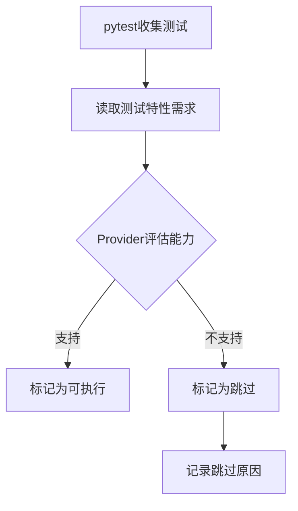

# 测试架构职责分配设计

## 架构概述

测试架构采用**关注点分离**原则，将测试逻辑与后端实现完全解耦。测试套件仅声明需求（特性列表），具体后端负责评估能力并决定执行策略。

```
┌─────────────────────────────────────┐
│      Test Suite (测试套件)           │
│  - 定义测试逻辑                      │
│  - 声明所需特性                      │
│  - 不知道运行环境                    │
└──────────────┬──────────────────────┘
               │ 特性列表
               ▼
┌─────────────────────────────────────┐
│     Provider Interface (接口层)      │
│  - 定义通信契约                      │
│  - 传递特性需求                      │
└──────────────┬──────────────────────┘
               │ 实现
               ▼
┌─────────────────────────────────────┐
│   Backend Provider (后端实现)        │
│  - 评估自身能力                      │
│  - 决定跳过策略                      │
│  - 准备测试环境                      │
└─────────────────────────────────────┘
```

## 一、测试套件职责

### 1.1 核心职责
- **定义测试逻辑**：纯粹的业务测试逻辑
- **声明特性需求**：每个测试需要哪些数据库特性
- **定义模型接口**：ActiveRecord模型的结构定义
- **提供测试工具**：通用的测试辅助函数

### 1.2 不负责的事项
- ❌ 不检查后端类型或版本
- ❌ 不包含SQL schema定义
- ❌ 不处理数据库连接
- ❌ 不决定是否跳过测试

### 1.3 特性声明方式

```python
# 测试套件只声明需要什么特性
from enum import Enum

class TestFeature(Enum):
    """测试可能需要的数据库特性"""
    BASIC_CRUD = "basic_crud"
    TRANSACTIONS = "transactions"
    ROLLUP = "rollup"
    CUBE = "cube"
    WINDOW_FUNCTIONS = "window_functions"
    CTE = "common_table_expressions"
    RECURSIVE_CTE = "recursive_cte"
    JSON_SUPPORT = "json_support"
    FULL_TEXT_SEARCH = "full_text_search"
    # ... 更多特性
```

### 1.4 测试标记示例

```python
# 使用装饰器声明特性需求
@requires_features(TestFeature.ROLLUP, TestFeature.CUBE)
def test_olap_queries(fixtures):
    """OLAP查询测试 - 需要ROLLUP和CUBE支持"""
    # 纯粹的测试逻辑，不关心后端
    results = Order.query().group_by_rollup("status", "category")
    assert len(results) > 0

# 或者使用元数据
test_metadata = {
    "test_id": "test_window_analytics",
    "required_features": [TestFeature.WINDOW_FUNCTIONS, TestFeature.CTE],
    "optional_features": [TestFeature.RECURSIVE_CTE]
}
```

### 1.5 模型定义示例

```python
# 测试套件定义模型结构，但不定义schema
class Order(ActiveRecord):
    __table_name__ = "orders"
    
    id: int
    user_id: int
    order_number: str
    total_amount: Decimal
    status: str
    created_at: datetime
```

## 二、Provider接口职责

### 2.1 核心接口定义

```python
class ITestFixtureProvider(ABC):
    """测试fixture提供者接口"""
    
    @abstractmethod
    def can_run_test(self, required_features: List[TestFeature]) -> Tuple[bool, Optional[str]]:
        """判断是否可以运行测试
        
        Args:
            required_features: 测试需要的特性列表
            
        Returns:
            (是否可运行, 跳过原因)
        """
        pass
    
    @abstractmethod
    def prepare_fixtures(self, fixture_type: str) -> Any:
        """准备测试fixtures"""
        pass
    
    @abstractmethod
    def cleanup_fixtures(self, fixtures: Any) -> None:
        """清理测试fixtures"""
        pass
```

### 2.2 通信契约
- **输入**：特性需求列表
- **输出**：执行决策（运行/跳过）
- **不传递**：后端类型、版本信息、具体实现细节

## 三、具体后端职责

### 3.1 核心职责
- **能力评估**：基于自身版本和特性评估能力
- **跳过决策**：决定哪些测试应该跳过
- **环境准备**：创建表、索引、初始数据
- **资源管理**：连接管理、事务控制、清理

### 3.2 版本检测示例

```python
class SQLiteProvider(BaseTestFixtureProvider):
    def __init__(self):
        self.version = self._detect_version()
        self.capabilities = self._determine_capabilities()
    
    def _detect_version(self):
        """检测SQLite版本"""
        import sqlite3
        return sqlite3.sqlite_version_info  # e.g., (3, 38, 0)
    
    def _determine_capabilities(self):
        """基于版本确定支持的特性"""
        caps = {TestFeature.BASIC_CRUD, TestFeature.TRANSACTIONS}
        
        if self.version >= (3, 25, 0):
            caps.add(TestFeature.WINDOW_FUNCTIONS)
        
        if self.version >= (3, 38, 0):
            caps.add(TestFeature.JSON_SUPPORT)
        
        # SQLite永远不支持ROLLUP/CUBE
        # caps中不包含TestFeature.ROLLUP, TestFeature.CUBE
        
        return caps
    
    def can_run_test(self, required_features):
        """判断测试是否可以运行"""
        missing = set(required_features) - self.capabilities
        
        if missing:
            feature_names = [f.value for f in missing]
            reason = f"SQLite {'.'.join(map(str, self.version))} 不支持: {', '.join(feature_names)}"
            return False, reason
        
        return True, None
```

### 3.3 MySQL版本差异处理

```python
class MySQLProvider(BaseTestFixtureProvider):
    def _determine_capabilities(self):
        """MySQL版本特性映射"""
        caps = {TestFeature.BASIC_CRUD, TestFeature.TRANSACTIONS}
        
        version = self._get_mysql_version()  # e.g., (5, 7, 38)
        
        if version >= (5, 7, 0):
            caps.add(TestFeature.ROLLUP)  # 5.7支持基础ROLLUP
            caps.add(TestFeature.JSON_SUPPORT)
        
        if version >= (8, 0, 0):
            caps.update({
                TestFeature.WINDOW_FUNCTIONS,
                TestFeature.CTE,
                TestFeature.RECURSIVE_CTE,
                TestFeature.CUBE,  # 8.0才支持CUBE
            })
        
        return caps
```

### 3.4 Schema定义职责

```python
class MySQLProvider:
    def prepare_order_table(self):
        """MySQL特定的schema定义"""
        schema = """
        CREATE TABLE orders (
            id INT AUTO_INCREMENT PRIMARY KEY,
            user_id INT NOT NULL,
            order_number VARCHAR(50) UNIQUE,
            total_amount DECIMAL(10,2),
            status ENUM('pending', 'paid', 'shipped'),
            created_at TIMESTAMP DEFAULT CURRENT_TIMESTAMP,
            INDEX idx_user_status (user_id, status),
            FOREIGN KEY (user_id) REFERENCES users(id)
        ) ENGINE=InnoDB DEFAULT CHARSET=utf8mb4
        """
        self.execute(schema)
```

## 四、执行流程

### 4.1 测试发现阶段



### 4.2 关键交互点

1. **测试套件 → Provider**：传递特性需求列表
2. **Provider内部**：评估自身能力（版本+特性）
3. **Provider → 测试框架**：返回执行决策

### 4.3 执行示例

```python
# conftest.py - 测试套件端
@pytest.fixture
def order_fixtures(request, provider):
    """通用fixture准备"""
    # 1. 获取测试的特性需求
    test_func = request.function
    required_features = getattr(test_func, '_required_features', [])
    
    # 2. 询问Provider是否可以运行
    can_run, skip_reason = provider.can_run_test(required_features)
    
    # 3. 根据Provider决策执行或跳过
    if not can_run:
        pytest.skip(skip_reason)
    
    # 4. Provider准备环境
    return provider.prepare_fixtures('order')
```

## 五、职责边界

### 5.1 清晰的边界

| 方面 | 测试套件 | 具体后端 |
|------|---------|----------|
| 特性定义 | ✅ 定义特性枚举 | ❌ |
| 特性需求 | ✅ 声明需要什么 | ❌ |
| 能力评估 | ❌ | ✅ 评估自己能做什么 |
| 版本检测 | ❌ | ✅ 检测自身版本 |
| 跳过决策 | ❌ | ✅ 决定是否跳过 |
| Schema定义 | ❌ | ✅ 定义表结构 |
| 测试逻辑 | ✅ 纯测试逻辑 | ❌ |
| SQL方言 | ❌ | ✅ 处理方言差异 |

### 5.2 信息流向

```
测试套件                     具体后端
   │                           │
   ├─ 特性需求列表 ─────────────→│
   │                           │
   │                           ├─ 内部：版本检测
   │                           ├─ 内部：能力映射
   │                           ├─ 内部：决策逻辑
   │                           │
   │←──────── 执行决策 ─────────┤
   │         (运行/跳过)        │
   │                           │
   │←──────── 准备的Fixtures ───┤
   │                           │
```

## 六、扩展性设计

### 6.1 添加新特性

测试套件端：
```python
class TestFeature(Enum):
    # 添加新特性
    GENERATED_COLUMNS = "generated_columns"  # 新增
    PIVOT_OPERATOR = "pivot_operator"        # 新增
```

后端实现端：
```python
def _determine_capabilities(self):
    # 后端根据版本决定是否支持
    if self.version >= (5, 7, 0):
        caps.add(TestFeature.GENERATED_COLUMNS)
    
    if self.backend_type == 'oracle':
        caps.add(TestFeature.PIVOT_OPERATOR)
```

### 6.2 添加新后端

只需实现Provider接口：
```python
class OracleProvider(BaseTestFixtureProvider):
    def _determine_capabilities(self):
        # Oracle特有的能力集
        return {
            TestFeature.BASIC_CRUD,
            TestFeature.ROLLUP,
            TestFeature.CUBE,
            TestFeature.PIVOT_OPERATOR,  # Oracle特有
            TestFeature.HIERARCHICAL_QUERY,  # Oracle特有
        }
```

## 七、优势总结

1. **关注点分离**：测试逻辑与后端实现完全分离
2. **单一职责**：每个组件职责明确且单一
3. **开闭原则**：对扩展开放，对修改关闭
4. **依赖倒置**：依赖于抽象（特性列表），而非具体实现
5. **可测试性**：测试套件可独立测试，后端可独立实现

## 八、实施建议

### 8.1 测试套件项目结构
```
rhosocial-activerecord-test-suite/
├── src/
│   └── test_suite/
│       ├── features.py      # 特性定义
│       ├── markers.py        # 测试标记
│       ├── models.py         # 模型定义
│       └── provider_api.py   # Provider接口
└── tests/
    ├── conftest.py           # 通用配置
    └── test_*.py             # 测试文件
```

### 8.2 具体后端项目结构
```
rhosocial-activerecord-mysql/
├── src/
│   └── mysql_provider/
│       ├── provider.py       # Provider实现
│       ├── schemas.py        # Schema定义
│       └── capabilities.py   # 能力映射
└── tests/
    └── run_suite.py          # 运行测试套件
```

### 8.3 集成方式

环境变量配置：
```bash
# 运行MySQL测试
export TEST_PROVIDER=mysql_provider.MySQLProvider
pytest ../test-suite/tests/

# 运行PostgreSQL测试
export TEST_PROVIDER=pg_provider.PostgreSQLProvider
pytest ../test-suite/tests/
```

## 九、示例：ROLLUP测试的完整流程

### 测试套件端
```python
@requires_features(TestFeature.ROLLUP)
def test_sales_rollup(order_fixtures):
    """销售汇总测试"""
    # 纯业务逻辑，不知道后端
    results = Order.summarize_by_category_with_rollup()
    assert_rollup_totals(results)
```

### SQLite后端
```python
# 能力：不包含TestFeature.ROLLUP
# 决策：跳过
# 原因："SQLite 3.38.0 不支持: rollup"
```

### MySQL 5.7后端
```python
# 能力：包含TestFeature.ROLLUP
# 决策：执行
# 动作：创建表 → 运行测试 → 清理
```

### MySQL 5.6后端
```python
# 能力：不包含TestFeature.ROLLUP (版本太低)
# 决策：跳过
# 原因："MySQL 5.6.51 不支持: rollup"
```

这种设计实现了完美的职责分离，测试套件专注于"要什么"，具体后端专注于"能给什么"和"怎么给"。