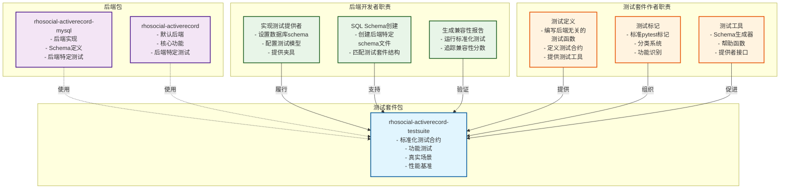
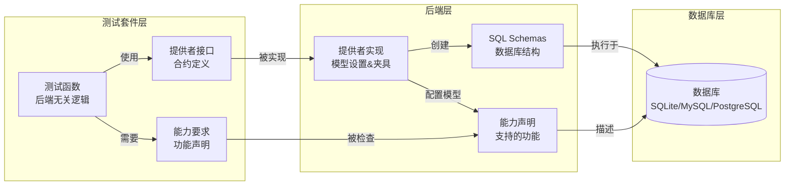

# 测试套件文档

本文档提供了使用测试套件的全面指南。

## 目录
- [1. 简介](#1-简介)
- [2. 后端开发者入门](#2-后端开发者入门)

## [1. 简介](#1-简介)

欢迎使用 ActiveRecord 测试套件。该软件包为所有与 `rhosocial-activerecord` 库集成的数据库后端提供了一套标准化的测试合约。

其主要目标是确保每个后端（无论是官方的还是第三方的）都遵循核心库所期望的一致且正确的行为。测试套件基于以下三大支柱构建：

- **功能测试**：验证独立的、原子性的功能（例如，CRUD 操作、查询方法、字段类型）。
- **真实场景测试**：模拟复杂的业务逻辑，测试不同组件之间的交互。
- **性能基准测试**：衡量和比较不同后端之间的性能指标。

**重要**：此测试套件仅包含测试逻辑，不包含环境准备，如夹具或数据库schema。相反，它提供了**接口**，后端应实现这些接口以提供这些资源。每个后端实现都有责任根据提供的接口创建和管理自己的测试环境。

### 架构概述

测试套件和后端关系遵循明确的关注点分离：



### 测试层架构



### 职责分工

#### 测试套件作者必须：
- 编写后端无关的测试逻辑
- 定义提供者接口
- 创建测试夹具和工具
- 永远不要假设后端特定功能
- 永远不要在测试中直接编写SQL
- 使用正确的category+capability格式记录所需能力

#### 后端开发者必须：
- 实现提供者接口
- 创建后端特定的schema文件
- 处理数据库连接/清理
- 分别编写后端特定的测试
- 生成兼容性报告
- 使用add_*方法声明后端能力

### 分工

| 组件 | 测试套件 | 后端 |
|-----------|-----------|---------|
| 测试逻辑 | ✅ 定义 | 使用 |
| SQL schemas | 提供模板 | ✅ 实现 |
| 数据库设置 | 定义接口 | ✅ 实现 |
| 模型配置 | 定义夹具 | ✅ 提供模型 |
| 清理/拆除 | 定义钩子 | ✅ 实现 |
| 能力声明 | 定义要求 | ✅ 声明支持 |

## [2. 后端开发者入门](#2-后端开发者入门)

要使用此测试套件来验证您的自定义数据库后端，请遵循以下步骤：

### 先决条件

- 一个可工作的数据库后端实现，它继承自 `rhosocial.activerecord.backend.StorageBackend`。
- 您的后端包应该可以在测试环境中安装。
- 您的后端必须实现用于提供测试夹具和数据库schema的所需接口。

### 安装

在您的后端项目的 `pyproject.toml` 中，将 `rhosocial-activerecord-testsuite` 添加为开发依赖项：

```toml
[project.optional-dependencies]
dev = [
    "rhosocial-activerecord-testsuite",
    "pytest-cov"
]
```