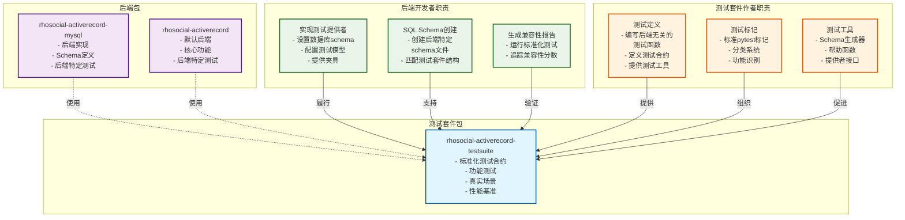
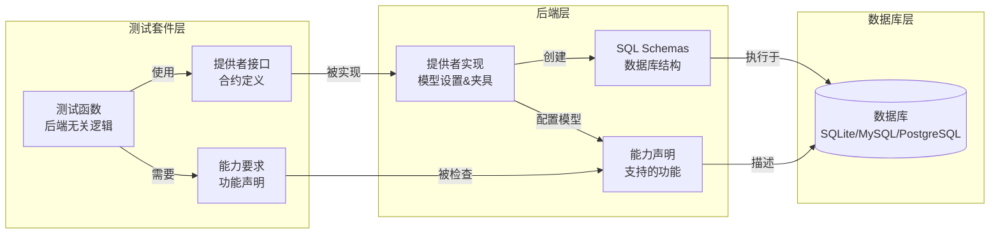

# 测试套件文档

本文档提供了使用测试套件的全面指南。

## 目录
- [1. 简介](#1-简介)
- [2. 后端开发者入门](#2-后端开发者入门)

## [1. 简介](#1-简介)

欢迎使用 ActiveRecord 测试套件。该软件包为所有与 `rhosocial-activerecord` 库集成的数据库后端提供了一套标准化的测试合约。

其主要目标是确保每个后端（无论是官方的还是第三方的）都遵循核心库所期望的一致且正确的行为。测试套件基于以下三大支柱构建：

- **功能测试**：验证独立的、原子性的功能（例如，CRUD 操作、查询方法、字段类型）。
- **真实场景测试**：模拟复杂的业务逻辑，测试不同组件之间的交互。
- **性能基准测试**：衡量和比较不同后端之间的性能指标。

**重要**：此测试套件仅包含测试逻辑，不包含环境准备，如夹具或数据库schema。相反，它提供了**接口**，后端应实现这些接口以提供这些资源。每个后端实现都有责任根据提供的接口创建和管理自己的测试环境。

### 架构概述

测试套件和后端关系遵循明确的关注点分离：


```mermaid
graph TB
    subgraph "后端包" 
        direction TB
        MYSQL[rhosocial-activerecord-mysql<br/>- 后端实现<br/>- Schema定义<br/>- 后端特定测试]
        DEFAULT[rhosocial-activerecord<br/>- 默认后端<br/>- 核心功能<br/>- 后端特定测试]
    end

    subgraph "测试套件包" 
        direction TB
        TS[rhosocial-activerecord-testsuite<br/>- 标准化测试合约<br/>- 功能测试<br/>- 真实场景<br/>- 性能基准]
    end

    subgraph "后端开发者职责" 
        direction TB
        PROVIDER[实现测试提供者<br/>- 设置数据库schema<br/>- 配置测试模型<br/>- 提供夹具]
        SCHEMA[SQL Schema创建<br/>- 创建后端特定<br/>  schema文件<br/>- 匹配测试套件结构]
        REPORT[生成兼容性报告<br/>- 运行标准化测试<br/>- 追踪兼容性分数]
    end

    subgraph "测试套件作者职责" 
        direction TB
        TESTDEF[测试定义<br/>- 编写后端无关的<br/>  测试函数<br/>- 定义测试合约<br/>- 提供测试工具]
        MARKER[测试标记<br/>- 标准pytest标记<br/>- 分类系统<br/>- 功能识别]
        UTIL[测试工具<br/>- Schema生成器<br/>- 帮助函数<br/>- 提供者接口]
    end

    %% 关系箭头
    MYSQL -.->|使用| TS
    DEFAULT -.->|使用| TS
    PROVIDER -->|履行| TS
    SCHEMA -->|支持| TS
    REPORT -->|验证| TS
    TESTDEF -->|提供| TS
    MARKER -->|组织| TS
    UTIL -->|促进| TS

    style TS fill:#e1f5fe,stroke:#01579b,stroke-width:2px
    style MYSQL fill:#f3e5f5,stroke:#4a148c,stroke-width:2px
    style DEFAULT fill:#f3e5f5,stroke:#4a148c,stroke-width:2px
    style PROVIDER fill:#e8f5e8,stroke:#1b5e20,stroke-width:2px
    style SCHEMA fill:#e8f5e8,stroke:#1b5e20,stroke-width:2px
    style REPORT fill:#e8f5e8,stroke:#1b5e20,stroke-width:2px
    style TESTDEF fill:#fff3e0,stroke:#e65100,stroke-width:2px
    style MARKER fill:#fff3e0,stroke:#e65100,stroke-width:2px
    style UTIL fill:#fff3e0,stroke:#e65100,stroke-width:2px
```

### 测试层架构


```mermaid
graph LR
    subgraph "测试套件层"
        TEST[测试函数<br/>后端无关逻辑]
        IFACE[提供者接口<br/>合约定义]
        CAPS[能力要求<br/>功能声明]
    end
    
    subgraph "后端层"
        PROV[提供者实现<br/>模型设置&夹具]
        SCHEMA[SQL Schemas<br/>数据库结构]
        CAPSDECL[能力声明<br/>支持的功能]
    end
    
    subgraph "数据库层"
        DB[(数据库<br/>SQLite/MySQL/PostgreSQL)]
    end
    
    TEST -->|使用| IFACE
    TEST -->|需要| CAPS
    IFACE -->|被实现| PROV
    CAPS -->|被检查| CAPSDECL
    PROV -->|创建| SCHEMA
    PROV -->|配置模型| CAPSDECL
    SCHEMA -->|执行于| DB
    CAPSDECL -->|描述| DB
```

### 职责分工

#### 测试套件作者必须：
- 编写后端无关的测试逻辑
- 定义提供者接口
- 创建测试夹具和工具
- 永远不要假设后端特定功能
- 永远不要在测试中直接编写SQL
- 使用正确的category+capability格式记录所需能力

#### 后端开发者必须：
- 实现提供者接口
- 创建后端特定的schema文件
- 处理数据库连接/清理
- 分别编写后端特定的测试
- 生成兼容性报告
- 使用add_*方法声明后端能力

### 提供者职责

提供者设计模式是测试套件的核心。每个后端必须实现一个提供者来处理：

1. **环境准备**（Setup）：
   - 创建数据库schema（表、索引、约束）
   - 建立数据库连接
   - 使用后端特定实现配置测试模型

2. **环境清理**（Teardown）：
   - 删除测试表
   - 正确关闭游标
   - 断开数据库连接

**关键：清理顺序**

提供者必须按正确顺序处理清理以避免问题：

```
正确顺序：
1. 执行 DROP TABLE 语句（清理数据）
2. 关闭所有游标
3. 断开数据库连接

错误顺序：
1. 先断开连接  ❌
2. 然后尝试清理  ❌ (连接已关闭！)
```

**为什么这很重要：**

不同后端有不同要求：

- **MySQL 异步**：在游标之前关闭连接可能导致 `RuntimeError: Set changed size during iteration`（由于 WeakSet 在迭代过程中被修改）
- **表冲突**：不删除表可能导致"表已存在"错误
- **数据污染**：不清理可能导致上下文相关测试失败
- **连接问题**：不当清理可能留下悬空连接，导致资源耗尽

**实现示例：**

```python
async def cleanup_after_test_async(self, scenario_name: str):
    """正确的清理顺序：先数据，后游标，最后断开连接。"""
    # 步骤 1：删除表（连接仍然存活时）
    for table in tables_to_drop:
        await self._backend.execute(f"DROP TABLE IF EXISTS {table}")
    
    # 步骤 2：显式关闭游标（断开连接之前）
    connection = self._backend._connection
    if connection is not None:
        for cursor in list(connection._cursors):
            await cursor.close()
    
    # 步骤 3：断开连接（最后一步）
    await self._backend.disconnect()
```

### 分工

| 组件 | 测试套件 | 后端 |
|-----------|-----------|---------|
| 测试逻辑 | ✅ 定义 | 使用 |
| SQL schemas | 提供模板 | ✅ 实现 |
| 数据库设置 | 定义接口 | ✅ 实现 |
| 模型配置 | 定义夹具 | ✅ 提供模型 |
| 清理/拆除 | 定义钩子 | ✅ 实现 |
| 能力声明 | 定义要求 | ✅ 声明支持 |

## [2. 后端开发者入门](#2-后端开发者入门)

要使用此测试套件来验证您的自定义数据库后端，请遵循以下步骤：

### 先决条件

- 一个可工作的数据库后端实现，它继承自 `rhosocial.activerecord.backend.StorageBackend`。
- 您的后端包应该可以在测试环境中安装。
- 您的后端必须实现用于提供测试夹具和数据库schema的所需接口。

### 安装

在您的后端项目的 `pyproject.toml` 中，将 `rhosocial-activerecord-testsuite` 添加为开发依赖项：

```toml
[project.optional-dependencies]
dev = [
    "rhosocial-activerecord-testsuite",
    "pytest-cov"
]
```