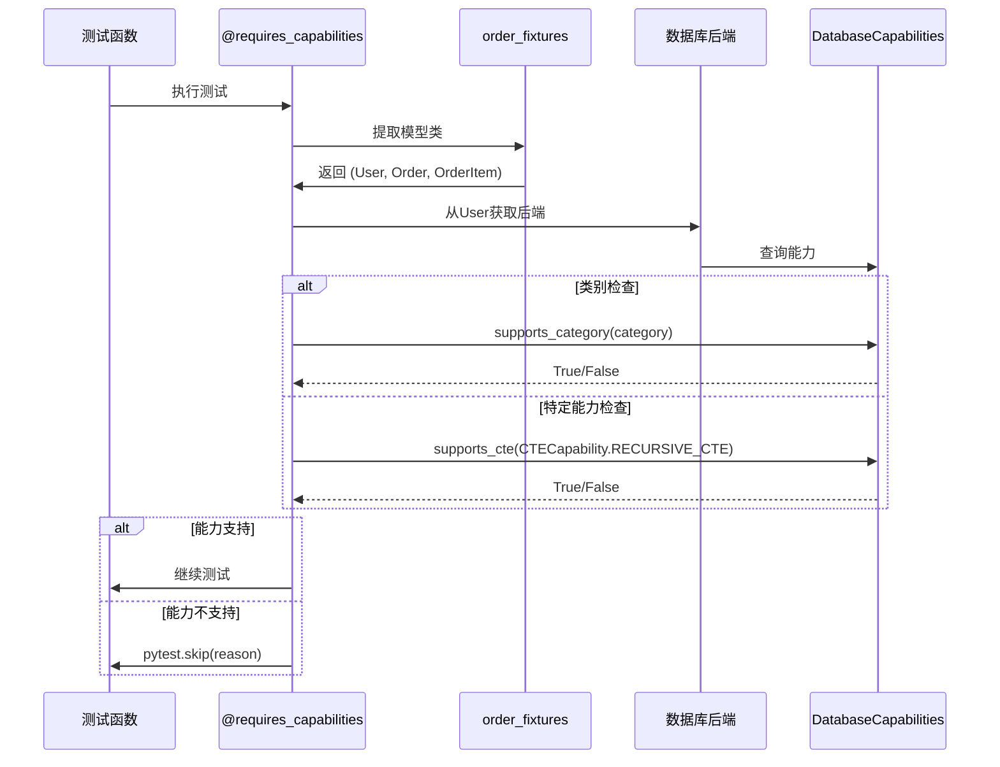

# 配置指南

本文档详细介绍了测试套件的各种配置选项。

## 目录
- [1. 基于接口的配置系统](#1-基于接口的配置系统)
- [2. 提供者模式实现](#2-提供者模式实现)
- [3. 后端能力声明](#3-后端能力声明)
- [4. 基于能力的测试选择](#4-基于能力的测试选择)

## [1. 基于接口的配置系统](#1-基于接口的配置系统)

测试套件基于一个灵活的接口系统运行，允许后端实现并提供自己的配置、schema和夹具管理。测试套件定义了需要什么，但后端负责提供实现。

### 提供者模式实现

提供者模式实现了跨后端的测试重用：

1. **测试套件定义** 测试逻辑和提供者接口
2. **后端实现** 提供者以配置模型/schemas
3. **测试执行** 使用提供者在不同后端上运行相同的测试
4. **能力检查** 确定哪些测试可以运行

### 核心提供者接口

```python
from abc import ABC, abstractmethod
from typing import Type, List, Tuple
from rhosocial.activerecord import ActiveRecord

class IQueryProvider(ABC):
    """查询功能测试的提供者接口。"""
    
    @abstractmethod
    def get_test_scenarios(self) -> List[str]:
        """返回可用的测试场景（例如，'local', 'docker'）。"""
        pass
    
    @abstractmethod
    def setup_order_fixtures(self, scenario_name: str) -> Tuple[Type[ActiveRecord], Type[ActiveRecord], Type[ActiveRecord]]:
        """
        设置订单相关模型 (User, Order, OrderItem)。

        返回:
            (User, Order, OrderItem) 模型类的元组
        """
        pass
    
    @abstractmethod
    def setup_tree_fixtures(self, scenario_name: str) -> Tuple[Type[ActiveRecord]]:
        """
        设置树结构模型 (Node)。

        返回:
            包含 (Node,) 的单元素元组
        """
        pass
    
    @abstractmethod
    def cleanup_after_test(self, scenario_name: str):
        """测试执行后清理。"""
        pass
```

### 后端驱动和命名空间

在配置之前，了解后端是如何加载的非常重要：

- **官方后端**：由 `rhosocial` 发布的后端安装在 `rhosocial.activerecord.backend.impl` 命名空间下（例如，`...impl.mysql`）。测试套件的默认配置加载器知道如何找到这些后端。
- **第三方后端**：如果您正在开发第三方后端，它应该位于自己的命名空间中（例如，`acme_corp.activerecord.backend.impl.acme_db`）。要使测试套件识别您的驱动，您需要注册它，通常使用 Python 的 `entry_points` 机制在您的包的 `pyproject.toml` 中进行。

### 必需的后端接口

每个后端必须实现以下接口以与测试套件正确配合：

- **Schema 提供者接口**：根据测试要求创建和管理数据库schema。
- **夹具 提供者接口**：根据测试规范提供测试夹具。
- **配置 提供者接口**：处理后端特定的配置选项。

### 内置 SQLite 支持

测试套件包含对 `rhosocial-activerecord` 附带的 `sqlite` 后端的内置支持。配置由您用于运行测试的 Python 版本决定。

- **自动检测**：默认情况下，测试套件会检测当前的 Python 版本（例如，3.11）并针对其相应的 SQLite 版本运行测试（例如，`sqlite_py311_mem` 和 `sqlite_py311_file`）。
- **CI/CD 覆盖**：您可以通过设置 `PYTEST_TARGET_VERSION` 环境变量来强制测试针对特定 Python 版本的配置运行。例如：
    ```bash
    PYTEST_TARGET_VERSION=3.10 pytest
    ```

### SQLite 测试场景

`rhosocial-activerecord` 的 SQLite 后端支持多种预定义的测试场景，可以通过环境变量激活。这些场景允许测试 SQLite 的不同操作模式和性能特征。

- **`memory`**：默认且最快的场景，使用内存中的 SQLite 数据库。此场景始终处于活动状态。
- **`tempfile`**：使用磁盘上的临时文件作为数据库。对于需要数据库持久性的测试功能非常有用。通过设置 `TEST_SQLITE_FILE=true` 激活。
- **`debug`**：一个内存中的数据库，通过日志配置启用 SQL 回显，用于调试目的。通过设置 `TEST_SQLITE_DEBUG=true` 激活。
- **`performance`**：一个内存中的数据库，配置了优化的 PRAGMA 设置，用于性能测试。通过设置 `TEST_SQLITE_PERFORMANCE=true` 激活。
- **`concurrent`**：使用基于文件的数据库，启用 WAL（Write-Ahead Logging）模式，用于并发测试。通过设置 `TEST_SQLITE_CONCURRENT=true` 激活。

您可以通过同时设置相应的环境变量来启用多个场景。例如：

```bash
export TEST_SQLITE_FILE=true
export TEST_SQLITE_DEBUG=true
export TEST_SQLITE_PERFORMANCE=true
export TEST_SQLITE_CONCURRENT=true
pytest
```

或者，您可以使用 `--test-scenarios` pytest 选项指定要运行的场景：

```bash
pytest --test-scenarios="memory,debug"
```

### 自定义后端配置

要测试您自己的后端（或其他可选后端，如 MySQL、PostgreSQL），您需要配置连接详细信息。这可以通过使用环境变量来完成。

#### 使用环境变量（推荐）

您可以通过在执行 `pytest` 的 shell 中设置一系列环境变量来定义一个或多个测试目标。使用数字后缀（`_1`、`_2` 等）来区分不同的配置。

例如，要定义一个名为 `mysql_ci` 的测试目标：
```bash
export AR_TEST_BACKEND_NAME_1=mysql_ci
export AR_TEST_BACKEND_DRIVER_1=mysql
export AR_TEST_BACKEND_HOST_1=127.0.0.1
export AR_TEST_BACKEND_PORT_1=3306
export AR_TEST_BACKEND_USER_1=root
export AR_TEST_BACKEND_PASSWORD_1=password
export AR_TEST_BACKEND_DATABASE_1=test_db
```

## 2. 基于能力的测试选择

### 概述

能力协商机制使用两级层次结构：

1. **能力类别** (CapabilityCategory)：顶级分组，如 CTE、WINDOW_FUNCTIONS
2. **特定能力**：每个类别中的单个功能

### 能力建筑

```python
# 能力层次结构
CapabilityCategory.CTE                    # 类别
    ├── CTECapability.BASIC_CTE          # 特定能力
    ├── CTECapability.RECURSIVE_CTE      # 特定能力
    └── CTECapability.MATERIALIZED_CTE   # 特定能力

CapabilityCategory.WINDOW_FUNCTIONS       # 类别
    ├── WindowFunctionCapability.ROW_NUMBER
    ├── WindowFunctionCapability.RANK
    └── WindowFunctionCapability.LAG

# 预定义组合
ALL_CTE_FEATURES = (
    CTECapability.BASIC_CTE |
    CTECapability.RECURSIVE_CTE |
    CTECapability.COMPOUND_RECURSIVE_CTE |
    CTECapability.CTE_IN_DML |
    CTECapability.MATERIALIZED_CTE
)
```

### 后端能力声明

```python
# 后端声明其能力
# src/rhosocial/activerecord/backend/impl/sqlite/backend.py
from rhosocial.activerecord.backend.capabilities import (
    DatabaseCapabilities,
    CapabilityCategory,
    CTECapability,
    WindowFunctionCapability,
    ALL_CTE_FEATURES,
    ALL_WINDOW_FUNCTIONS
)

class SQLiteBackend(StorageBackend):
    def _initialize_capabilities(self):
        """初始化并返回后端的能力描述符。"""
        capabilities = DatabaseCapabilities()
        version = self.get_server_version()

        # CTEs 支持从 3.8.3+
        if version >= (3, 8, 3):
            # 添加特定能力
            capabilities.add_cte([
                CTECapability.BASIC_CTE,
                CTECapability.RECURSIVE_CTE
            ])
            # 这会自动添加 CapabilityCategory.CTE

        # 窗口函数从 3.25.0+
        if version >= (3, 25, 0):
            # 使用预定义组合
            capabilities.add_window_function(ALL_WINDOW_FUNCTIONS)

        return capabilities
```

### 声明测试要求

测试必须指定类别和特定能力：

```python
# 正确格式：(category, specific_capability)
from rhosocial.activerecord.backend.capabilities import (
    CapabilityCategory,
    CTECapability
)
from rhosocial.activerecord.testsuite.utils import requires_capabilities

# 单个能力要求
@requires_capabilities((CapabilityCategory.CTE, CTECapability.BASIC_CTE))
def test_basic_cte(order_fixtures):
    """测试需要基本CTE支持。"""
    pass

# 同一类别中的多个能力
@requires_capabilities((CapabilityCategory.CTE, [CTECapability.BASIC_CTE, CTECapability.RECURSIVE_CTE]))
def test_recursive_cte(tree_fixtures):
    """测试需要基本和递归CTE。"""
    pass

# 不同类别中的多个能力
@requires_capabilities(
    (CapabilityCategory.CTE, CTECapability.RECURSIVE_CTE),
    (CapabilityCategory.WINDOW_FUNCTIONS, WindowFunctionCapability.ROW_NUMBER)
)
def test_complex_query(order_fixtures):
    """测试需要递归CTE和窗口函数。"""
    pass

# 仅类别检查（类别中的任何能力）
@requires_capabilities((CapabilityCategory.JSON_OPERATIONS, None))
def test_json_support(json_user_fixtures):
    """测试需要任何JSON操作支持。"""
    pass
```

### 能力检查过程



### 运行时 vs 收集时检查

**收集时检查** (在 conftest.py 中)：
- 更快 - 在测试执行前检查能力
- 需要在收集阶段访问后端
- 如果后端初始化开销大，可能需要变通方法
- 如果在设置期间尝试访问夹具，可能会引起问题

**运行时检查** (在测试或装饰器中)：
- 更慢 - 在测试执行时检查能力
- 始终准确 - 使用实际配置的后端
- 推荐用于动态能力场景
- 使用 `pytest_runtest_call` 钩子访问包含已解析夹具的 `item.funcargs`

**常见问题及解决方案：**
如果在 `pytest_runtest_setup` 中执行能力检查并尝试访问夹具，可能会引起如下问题：
`AssertionError: (<Function test_func[memory]>, {})` - 这是在测试设置期间尝试访问夹具时发生的。
将能力检查移到 `pytest_runtest_call` 并通过 `item.funcargs` 访问夹具，而不是使用 `request.getfixturevalue()`。

### 夹具 vs 原始对象访问模式

**复合夹具返回模式：**
当夹具返回模型元组（如 `order_fixtures` 返回 `(User, Order, OrderItem)`）但测试期望元组时：
- 测试代码可能使用：`Node = tree_fixtures[0]`
- 但夹具返回原始对象：`yield Node` 而不是 `yield (Node,)`
- 这导致错误：`TypeError: cannot be parametrized because it does not inherit from typing.Generic`
- 解决方案：如果测试代码期望元组索引，请确保夹具返回元组

**正确的夹具实现：**
```python
# 如果测试使用 tree_fixtures[0]，返回元组
@pytest.fixture
def tree_fixtures(request):
    # 通过夹具组获取测试的Node模型
    result = provider.setup_tree_fixtures(scenario)
    
    # 确保我们返回元组以与测试期望保持一致
    if isinstance(result, tuple):
        yield result
    else:
        # 如果只返回单个模型，将其包装在元组中
        yield (result,)
```