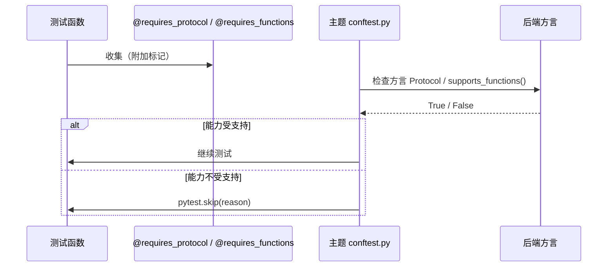

# 配置指南

本文档详细介绍了测试套件的各种配置选项。

## 目录
- [1. 基于接口的配置系统](#1-基于接口的配置系统)
- [2. 基于能力的测试选择](#2-基于能力的测试选择)

## [1. 基于接口的配置系统](#1-基于接口的配置系统)

测试套件基于一个灵活的接口系统运行，允许后端实现并提供自己的配置、schema和夹具管理。测试套件定义了需要什么，但后端负责提供实现。

### 提供者模式实现

提供者模式实现了跨后端的测试重用：

1. **测试套件定义** 测试逻辑和提供者接口
2. **后端实现** 提供者以配置模型/schemas
3. **测试执行** 使用提供者在不同后端上运行相同的测试
4. **能力检查** 确定哪些测试可以运行

### 核心提供者接口

```python
from abc import ABC, abstractmethod
from typing import Type, List, Tuple
from rhosocial.activerecord.model import ActiveRecord

class IQueryProvider(ABC):
    """查询功能测试的提供者接口。"""

    @abstractmethod
    def get_test_scenarios(self) -> List[str]:
        """返回可用的测试场景（例如，'sqlite_memory', 'mysql_80'）。"""
        pass

    @abstractmethod
    def setup_order_fixtures(self, scenario_name: str) -> Tuple[Type[ActiveRecord], ...]:
        """
        设置订单相关模型 (User, Order, OrderItem)。

        返回:
            (User, Order, OrderItem) 模型类的元组
        """
        pass

    @abstractmethod
    def teardown_order_fixtures(self, scenario_name: str) -> None:
        """拆除订单相关夹具（断开连接、删除表）。"""
        pass

    @abstractmethod
    async def async_setup_order_fixtures(self, scenario_name: str) -> Tuple[Type[ActiveRecord], ...]:
        """
        异步设置订单相关模型。

        返回:
            (AsyncUser, AsyncOrder, AsyncOrderItem) 模型类的元组
        """
        pass

    @abstractmethod
    async def async_teardown_order_fixtures(self, scenario_name: str) -> None:
        """异步拆除订单相关夹具。"""
        pass
```

设置与拆除钩子以**成对**方法声明，同步与异步 API 分别声明：
`setup_*_fixtures` / `teardown_*_fixtures` 以及 `async_setup_*_fixtures` /
`async_teardown_*_fixtures`。只支持一侧的后端实现对应的一对，另一对保持
`@abstractmethod`（其 conftest 则只导入受支持的文件）。

### 后端驱动和命名空间

后端通过**provider 注册表**被发现，而非由测试套件的默认配置加载器硬编码：

- 后端在 `tests/providers/registry.py` 中注册其 provider 类。
- 测试套件通过 `TESTSUITE_PROVIDER_REGISTRY` 环境变量定位该注册表
  （测试套件的 `conftest.py` 将其默认设为 `providers.registry:provider_registry`，
  后端可在自身 `tests/conftest.py` 中覆盖它）。

### 必需的后端接口

每个后端必须针对每个主题实现该主题 `interfaces.py` 中定义的 provider 接口
（schema 创建、夹具生成和配置均属于同一 provider 合约）。该合约是成对的：
同步为 `setup_*_fixtures` / `teardown_*_fixtures`，异步为
`async_setup_*_fixtures` / `async_teardown_*_fixtures`。

### 内置 SQLite 支持

测试套件包含对 `rhosocial-activerecord` 附带的 `sqlite` 后端的内置支持。
SQLite 是参考后端：它提供 provider 实现、场景集合和模型夹具，供其他后端参照。

### Provider 注册表与场景

测试套件通过 **provider 注册表** 将自身与任何特定后端解耦。后端通过注册表模块暴露其 provider 实现，测试套件通过 `TESTSUITE_PROVIDER_REGISTRY` 环境变量定位它（测试套件的 `conftest.py` 默认将其设为 `providers.registry:provider_registry`）。

```bash
export TESTSUITE_PROVIDER_REGISTRY='tests.providers.registry:provider_registry'
```

每个 provider 通过 `get_test_scenarios()` 声明一个或多个**场景**（如 `sqlite_memory`、`mysql_80`、`firebird_5`）。测试会跨已注册的场景进行参数化。`--scenarios` pytest 选项可选择其中一部分：

```bash
pytest --scenarios=sqlite_memory,mysql_80
```

### 自定义后端配置

要测试您自己的后端，您需要编写一个实现主题接口的 provider，并在后端的 `tests/providers/registry.py` 中注册它。连接详情（主机、端口、凭据、数据库）放在您的 provider 内部，而不再放在测试套件中。然后 `--scenarios` 选项选择要运行的场景。

相关 conftest 选项：

- `--scenarios=<list>` — 要运行的逗号分隔场景名列表。
- `--scenarios-parallel` / `--no-scenarios-parallel` — 是否将同一测试的场景变体分布到 `pytest-xdist` worker 上（默认 `True`）。
- `--db-pool-size=<n>` — 每个场景预备的 `test_db_*` 数据库池大小（默认为 worker 数量；`0` 禁用池）。
- `--serial-group=<name>` — 用于固定串行测试的 `xdist_group` 名称。

## [2. 基于能力的测试选择](#2-基于能力的测试选择)

### 概述

后端特有的、并非每个数据库都通用的能力，通过**恰好两个**通用的 pytest 装饰器表达，二者均定义在 `rhosocial.activerecord.testsuite.utils`：

| 装饰器 | 标记 | 捕获 |
|-----------|--------|----------|
| `requires_protocol(ProtocolClass, method_name=None)` | `requires_protocol` | 由方言上的 Protocol 类表达的能力（可选特定 `supports_*` 方法）。 |
| `requires_functions(*fn_names)` | `requires_functions` | 由方言的 `supports_functions(...)` 接受的 SQL 函数名表达的能力。 |

二者都会展开为单个 pytest 标记；运行时跳过逻辑位于主题级 `conftest.py` 文件中，通过 `request.node.get_closest_marker(...)` 读取标记。当所需能力不受支持时，测试在该后端上被**跳过**而非失败。

**不要**引入每个功能的别名标记（如 `requires_partition`、`requires_cte`、`requires_json`）。这两个通用装饰器是代码库中唯一的能力标记。

### 声明 Protocol 类要求

```python
from rhosocial.activerecord.backend.dialect.protocols import WindowFunctionSupport
from rhosocial.activerecord.testsuite.utils import requires_protocol

# 协议级要求（任意支持）
@requires_protocol(WindowFunctionSupport)
def test_window_functions(order_fixtures):
    """测试需要窗口函数支持。"""
    pass

# 特定方法要求
@requires_protocol(WindowFunctionSupport, "supports_window_functions")
def test_window_functions(order_fixtures):
    """测试需要 supports_window_functions 能力。"""
    pass
```

### 声明 SQL 函数要求

```python
from rhosocial.activerecord.testsuite.utils import requires_functions

# 单个函数要求
@requires_functions('json_array_insert')
def test_json_insert(json_fixtures):
    """测试需要 json_array_insert SQL 函数。"""
    pass

# 多个函数要求（必须全部受支持）
@requires_functions('json_array_insert', 'jsonb_array_insert')
def test_json_operations(json_fixtures):
    """测试需要多个 JSON SQL 函数。"""
    pass
```

### 能力检查过程


```mermaid
sequenceDiagram
    participant Test as 测试函数
    participant Marker as @requires_protocol / @requires_functions
    participant Conftest as 主题 conftest.py
    participant Dialect as 后端方言
    
    Test->>Marker: 收集（附加标记）
    Conftest->>Dialect: 检查方言 Protocol / supports_functions()
    Dialect-->>Conftest: True / False
    
    alt 能力受支持
        Conftest->>Test: 继续测试
    else 能力不受支持
        Conftest->>Test: pytest.skip(reason)
    end
```

### 运行时 vs 收集时检查

能力检查在**运行时**进行，即 provider 配置后端之后，因为后端能力只有在 provider 配置的模型针对某一场景绑定到实时后端之后才可用。

- 主题级 `conftest.py` 在测试执行期间读取标记
  (`request.node.get_closest_marker(...)`)，并内联跳过测试。
- 优先将标记作为「此测试需要能力 X」的**单一事实来源**。不要同时在测试体中再次检查 `supports_X()`；内联 `pytest.skip` 仅用于场景本地条件。

### 夹具 vs 原始对象访问模式

**复合夹具返回模式：**
当夹具返回模型元组（如 `order_fixtures` 返回 `(User, Order, OrderItem)`）时，provider 的 `setup_*_fixtures` 方法即对于单个模型也必须返回元组，以便测试代码可以一致地索引它。

provider 方法因此应始终返回元组：

```python
# 正确 — 始终是元组，即使对于单个模型
def setup_tree_fixtures(self, scenario):
    Node = self._configure_node(scenario)
    return (Node,)
```